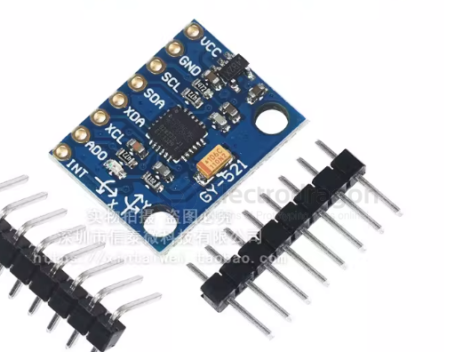
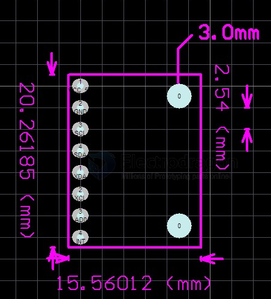

# SMO1020-dat

- [[sensor-motion-dat]] - [[MPU6050-dat]] - [[MPU6000-dat]]

- [[6-axis-dat]] 

[MPU-6050 Three-Axis Acceleration & Gyroscope 6DOF Module](https://www.electrodragon.com/product/mpu-6050-three-axis-acceleration-gyroscope-6-dof-module/)

## board info 

Name: MPU-6050 Module (Three-Axis Gyroscope + Three-Axis Accelerometer)

Chip Used: MPU-6050

Power Supply: 3-5V (Internal Low Dropout Regulator)

Communication Method: Standard IIC Communication Protocol

Built-in 16-bit AD Converter, 16-bit Data Output

Gyroscope Range: ±250 500 1000 2000 °/s

Acceleration Range: ±2±4±8±16g

Immersion Gold PCB, Machine Soldering Process Ensures Quality

Pin Pitch: 2.54mm

## pin definitions 

- VCC = 3-5V
- GND 
- SCL
- SDA
- SCL
- ADO
- INT 

## APP 

- [[robot-balancer-dat]] - [[robot-dat]] - [[motor-driver-dat]]

- [[head-track-dat]]

- [[app-dat]]

## ref 

- [[MPU9250-dat]] - [[MPU6500-dat]]

- [[MMA7361-dat]]

- [[SMO1020]]