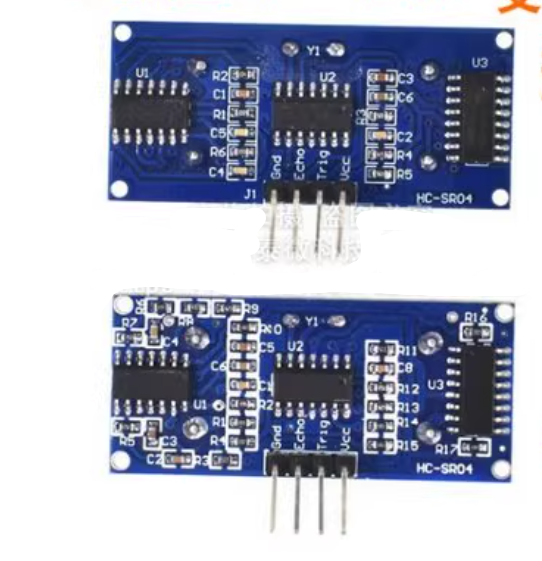

# SMO1058-dat

## Info

[product url - HC-SR04 Ultrasonic Proximity Sensor R2](https://www.electrodragon.com/product/ultrasonic-proximity-sensor/)

Buck order price 17% discount for 50pcs, auto update price in cart.

### Board Map, Dimension, Pins, chip info, Use Guide, Setup Jumper, etc.

Voltage：DC 3.3 – 5V (R2 version now is 3.3V-5V compatible)

version new-top and old-bottom 

### Pins and Wiring

- VCC
- TRIG (trigger / control input)
- ECHO (echo / receive output)
- OUT (spare pin)
- GND

Note: The TRIG pin has an internal 10 kΩ pull-up resistor. To trigger the module from a microcontroller, pull the TRIG pin low with an MCU I/O pin, then send a pulse longer than 10 µs.

- OUT: When the module is used as an alarm/anti-theft module, the OUT pin provides a digital switch output. This pin is not used for distance measurement.

Power-up note:

- Insert the module onto the circuit board before applying power to avoid unwanted false high outputs. If a false high occurs, power-cycle the module to clear it.

Reference test firmware:

- Example test programs available for: C51, PIC18F877, and Yilong MCU.

### Operation / Working Principle

1. Triggering
   - The module is triggered by the TRIG pin. Provide a high pulse of at least 10 µs to start a measurement.

2. Transmission and detection
   - After trigger, the module automatically transmits 8 cycles of 40 kHz square waves and listens for an echo.

3. Echo output and timing
   - When an echo is detected, the ECHO output goes high. The duration of this high pulse equals the round-trip travel time of the ultrasonic pulse (transmit → reflect → receive).

Distance calculation

- Distance = (high_time * speed_of_sound) / 2
- Using speed of sound ≈ 340 m/s.

Examples and MCU integration

- Typical method: send a >10 µs high pulse on TRIG. Wait for ECHO to go high, start a timer when ECHO goes high, stop the timer when ECHO goes low. The measured timer value is the round-trip time.
- If the timer measures microseconds (us): distance (cm) = time_us * 0.017 (because 340 m/s = 0.034 cm/us, divide by 2 → 0.017 cm/us).

Continuous measurement

- Repeating this trigger–measure cycle periodically allows continuous distance tracking or motion detection.

## Applications, category, tags, etc. 

- [[sensor-ultrasonic-dat]]

## Demo Code and Video

## ref 

- [[SMO1058]] 

- [legacy wiki page ](https://www.electrodragon.com/w/index.php?title=HC-SR04_Ultrasonic_sensor)

