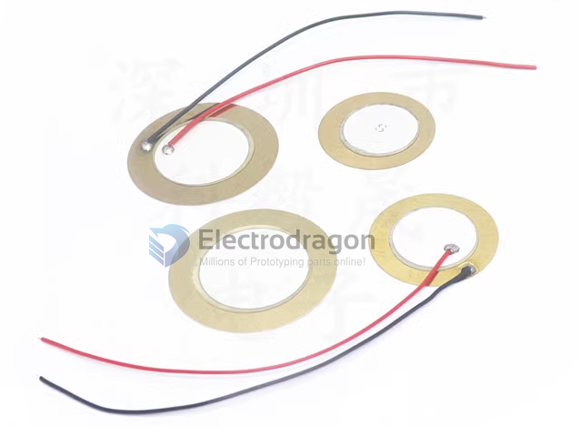

# SMO1068-dat 

- diameter 27mm 
- default not included the wires
- if you need wires please add notes: free for within 5pcs, extra cost for more than 5pcs 

## note - Oxidation

When exposed to external pollution or exposed to the air for a long time, the white silver layer and metal substrate of the buzzer are prone to oxidation problems such as yellowing and blackening of the surface. This is a normal phenomenon and will not affect the electrical performance of the product!

## ref 

- [[SMO1068]]