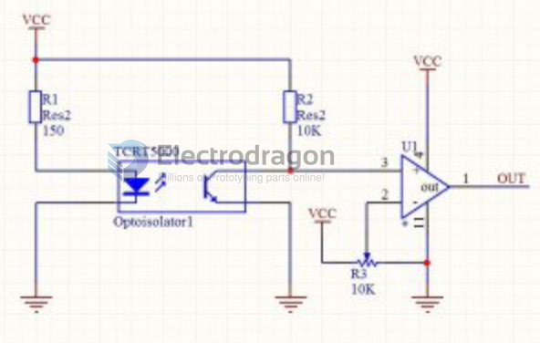
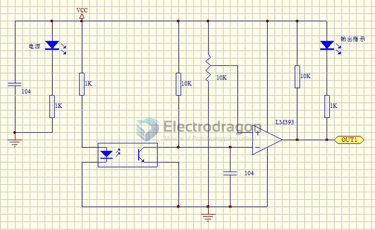
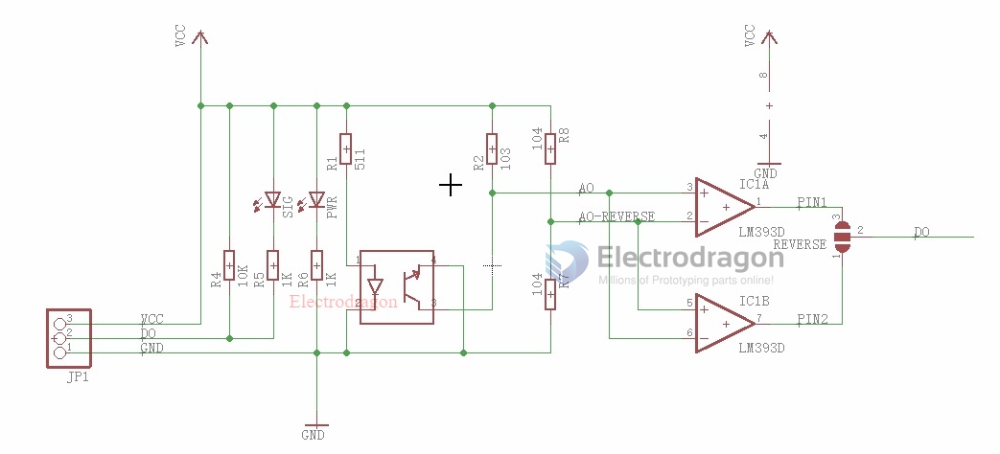
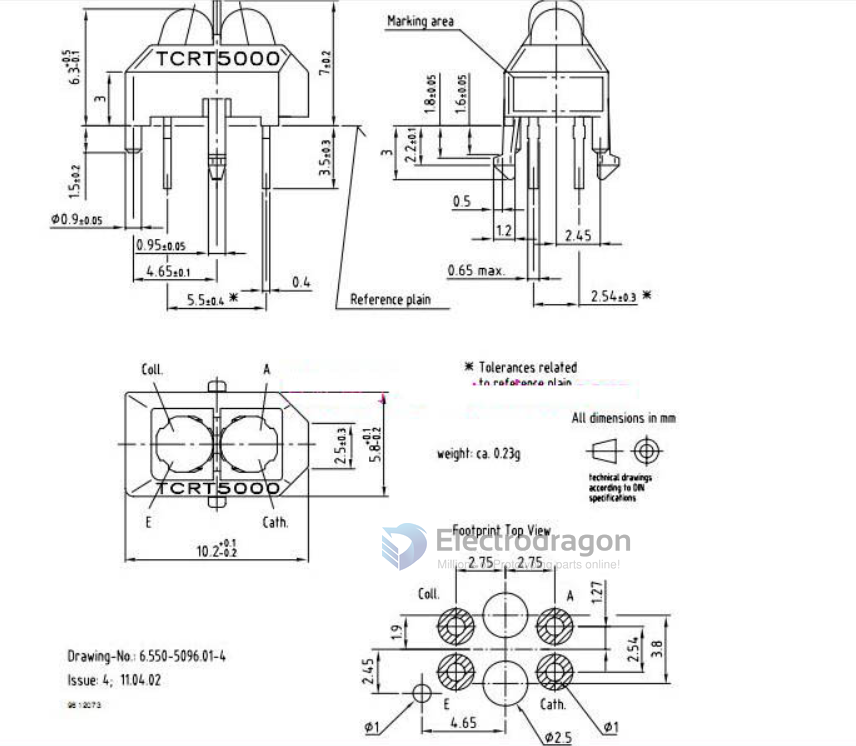

# SMO1070-dat

## TCRT5000 Module SCH 

full module SCH 

## TCRT5000 specs 

### Pins of TCRT5000

* Coll. = Collector (VCC)
* E. = Emitter (GND)
* A. = Anode (VCC)
* Cath. = Cathode (GND)

## ITR Series 

* ITR9608 - [[ITR9608.pdf]]
* ITR9909

## ref 

- [[IR-reflective-sensor-dat]]