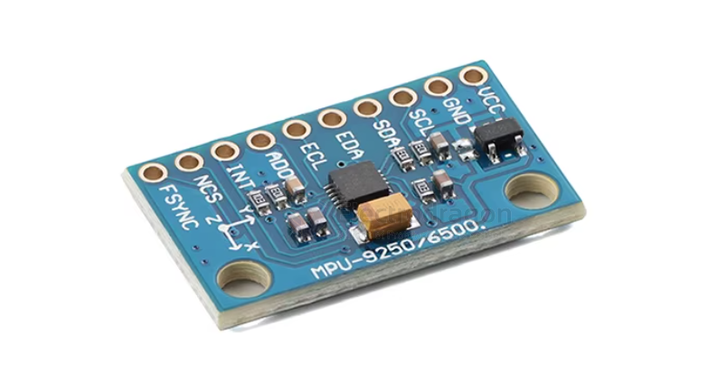

# SMO1080-dat

## Info

[product url - 6DOF MPU-6500 Breakout, 3D Accelero + Gyro](https://www.electrodragon.com/product/6dof-mpu-6500-3d-accelerogyro-breakout/)

- [[6-axis-dat]]

### Board Map, Dimension, Pins, chip info, Use Guide, Setup Jumper, etc.

Pin Descriptions

- VCC: Positive Power Supply
- GND: Negative Power Supply
- SCL: IIC Clock Signal Line
- SDA: IIC Data Signal Line
- EDA: IIC Master Serial Data, used to connect to external sensors
- ECL: IIC Master Serial Clock, used to connect to external sensors
- ADO: IIC Slave Address Pin
- INT: Interrupt Digital Pin
- NCS: Chip Select (SPI Mode Only)
- FSYNC: Frame Synchronization Digital Input. Connect to GND if not used.

## Applications, category, tags, etc. 

## Demo Code and Video

## ref 

- [[SMO1080]] 

- legacy wiki page 
