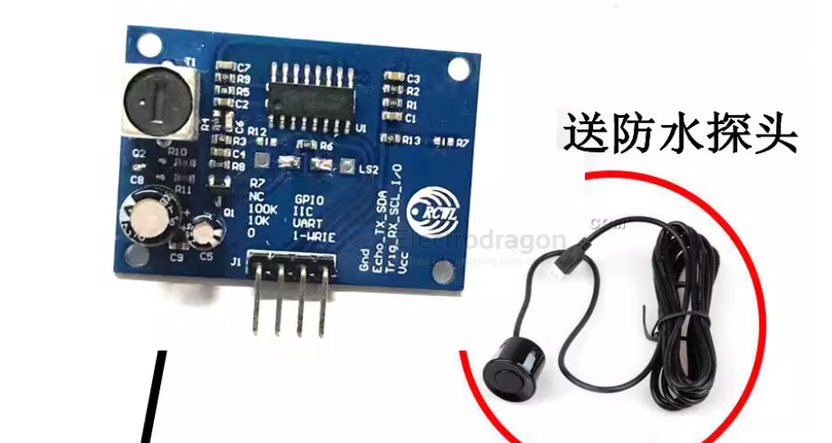
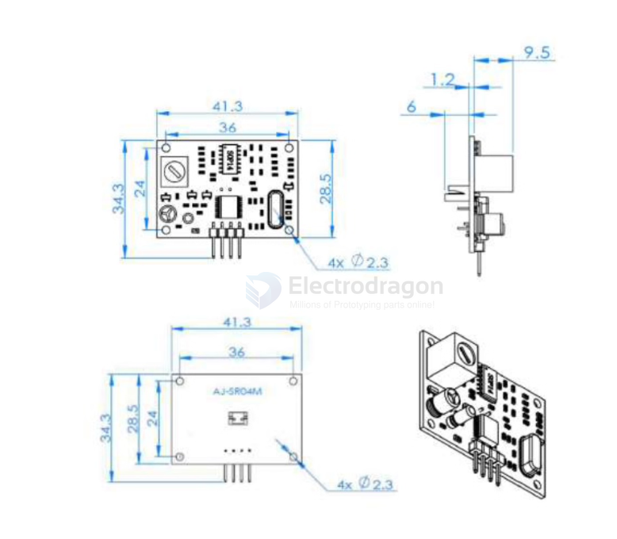
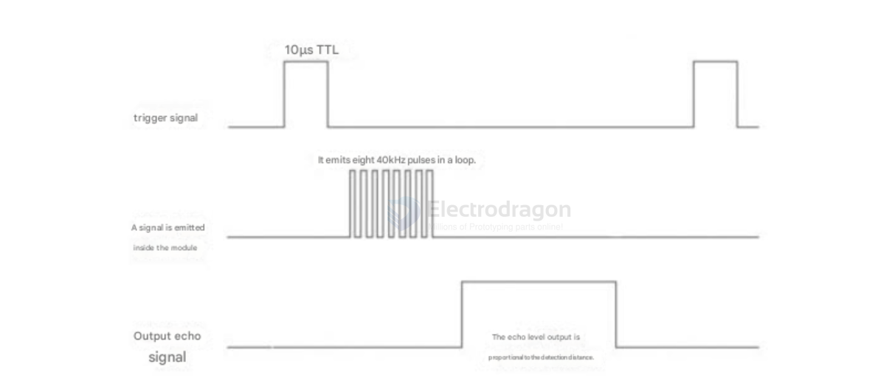
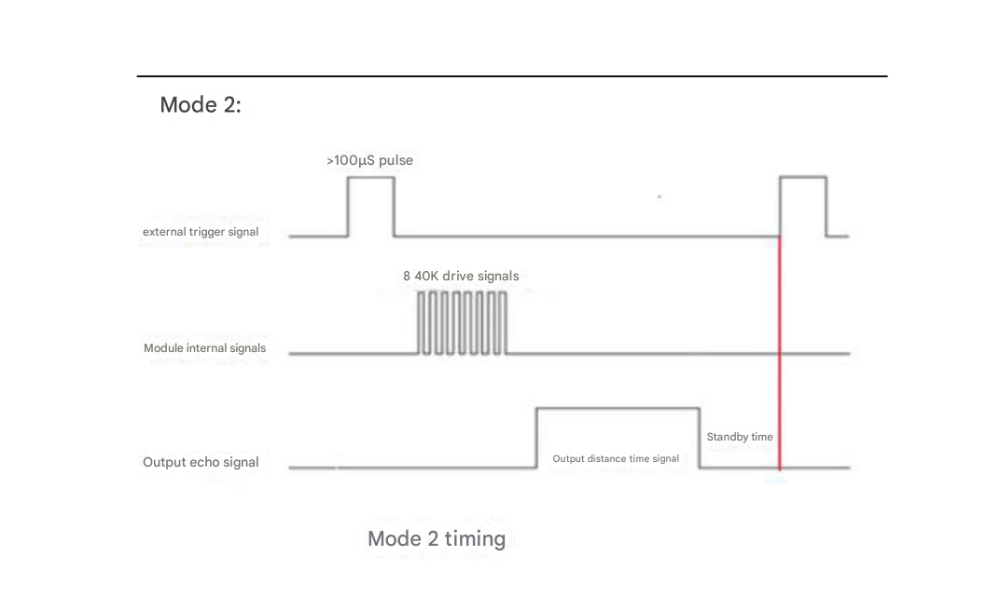
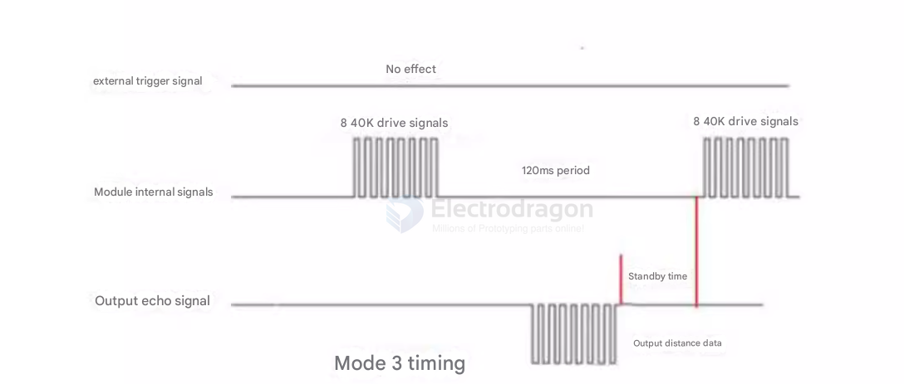
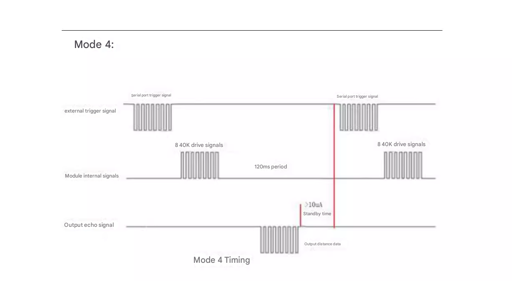
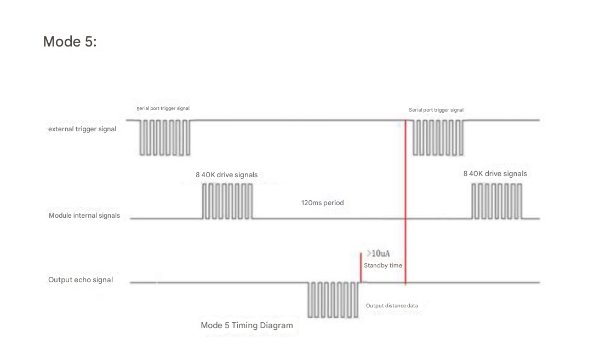

# SMO1085-dat

## Info

[product url - Integrated Ultrasonic Proximity Sensor, Reversing radar, SR04T](https://www.electrodragon.com/product/integrated-ultrasonic-proximity-sensor-reversing-radar-sr04t/)

### Board Map, Dimension, Pins, chip info, Use Guide, Setup Jumper, etc.

- [[sensor-ultrasonic-dat]]

- sensor probe is waterproofed - [[waterproof-dat]]

The integrated ultrasonic proximity module provides non-contact distance sensing from 20 cm to 600 cm. The module integrates a transmitter/receiver transducer and control circuitry. The separate probe includes a 2.5 m cable.

### Specifications

- Supply voltage: DC 3.0–5.5 V
- Operating current: < 8 mA
- Probe frequency: 40 kHz
- Maximum range: 600 cm
- Minimum range: 20 cm
- Long-range accuracy: ±1 cm
- Resolution: 1 mm
- Measurement angle: 75°

### Inputs / Outputs

- Trigger input:
  1. TTL pulse ≥ 10 µs
  2. Serial command 0x355
- Echo output: pulse-width output (TTL)

### Pins / Wiring

- VCC: 3–5.5 V (power)
- TRIG: trigger / control input
- RX / ECHO: echo / output
- TX: serial transmit (if applicable)
- GND: ground (power negative)

### Mechanical & Environmental

- Dimensions: L 42 × W 29 × H 12 mm
- Operating temperature: -20 °C to +70 °C
- PCB color: blue

### Pin Description

- VCC: Power (positive)
- TRIG / RX: Trigger input (send a high pulse ≥ 10 µs to start a measurement) / UART RX (receive)
- ECHO / TX: Echo output — outputs a high pulse when a measurement completes; pulse width equals the ultrasonic round-trip time / UART TX (transmit)
- GND: Ground (power negative)

### Usage and Operating Modes

This module supports three selectable operating modes. Change the R27 resistor configuration to select a mode.

Mode 1 — Pulse/Trigger mode (R27 = open / no resistor soldered)

1. Operation
   - Use the TRIG pin to trigger a measurement: apply a high pulse of at least 10 µs.
   - The module will automatically transmit 8 cycles of 40 kHz and listen for an echo.
   - When an echo is detected, the ECHO pin goes high; the high pulse duration equals the round-trip time of the ultrasonic signal.
   - Distance = (high_time × speed_of_sound) / 2 (speed_of_sound ≈ 340 m/s).
   - If no echo is received (out of range or probe not aimed at the target), the ECHO pin will automatically go low after 60 ms to indicate measurement end.
   - LED indicator: the LED is not a power indicator. It lights only when the module receives a trigger and is actively measuring.

2. Timing diagram

Mode 2 — Auto-UART output (R27 = 47 kΩ soldered)

- The module continuously outputs distance measurements over TTL serial at a 100 ms interval. Units: mm.
- Serial settings: 9600, N, 8, 1.

Mode 3 — Command-triggered UART (R27 = 120 kΩ soldered)

- On power-up the module enters standby and outputs TTL serial at 9600, N, 8, 1.
- When the RX pin receives the command 0x55, the module performs a single measurement and sends a data frame on TX.
- Frame format: 0xFF, H_DATA, L_DATA, SUM (4 bytes), where H_DATA and L_DATA contain the measured distance.

### Operation (Modes 1–5)

Mode 1 — HC-SR04 compatible trigger mode

- Trigger: apply a TRIG pulse > 10 µs.
- Behavior: the module performs one measurement; the ECHO pin outputs a high pulse whose duration equals the ultrasonic round-trip time.
- Distance calculation: distance = (ECHO_high_time × speed_of_sound) / 2 (speed ≈ 340 m/s).
- Typical current (active average): ~6 mA.

Mode 2 — Low-power trigger mode

- Trigger: apply a TRIG pulse > 100 µs.
- Behavior: the module performs one measurement; ECHO outputs a high pulse while measuring. Distance is calculated the same way as Mode 1.
- Standby current: ~10 µA.

Mode 3 — Auto periodic UART output

- The module automatically sends a data frame every 100 ms over TTL serial.
- Serial settings: 9600, N, 8, 1.
- Frame format (4 bytes): 0xFF, H_DATA, L_DATA, SUM
  - 0xFF: start byte
  - H_DATA: high 8 bits of distance
  - L_DATA: low 8 bits of distance
  - SUM: checksum = (H_DATA + L_DATA) & 0xFF
- Distance = (H_DATA << 8) | L_DATA (unit: mm).

Example

- Example frame: 0xFF 0x07 0xA1 0xA8
  - H_DATA = 0x07, L_DATA = 0xA1
  - Checksum SUM = (0x07 + 0xA1) & 0xFF = 0xA8
  - Distance = 0x07A1 = 1953 mm
- Typical current (active average): ~6.5 mA.

Mode 4 — Command-triggered UART / RX-trigger

- Trigger: send a serial byte to RX or pull RX low once to start a single measurement.
- After measurement the module outputs one data frame on TX using the same 4-byte format as Mode 3 (0xFF, H_DATA, L_DATA, SUM).
- Serial settings: 9600, N, 8, 1.
- Standby current: ~7 µA.

Mode 5 — ASCII serial output

- Same trigger mechanism as Mode 4; the difference is the output format: ASCII text (human-readable) so distance can be displayed directly in serial terminal software.
- Standby current: ~7 µA.

## Applications, category, tags, etc. 

## Demo Code and Video

## ref 

- [[SMO1085]] 

- legacy wiki page - https://w.electrodragon.com/w/Proximity_SR04T

