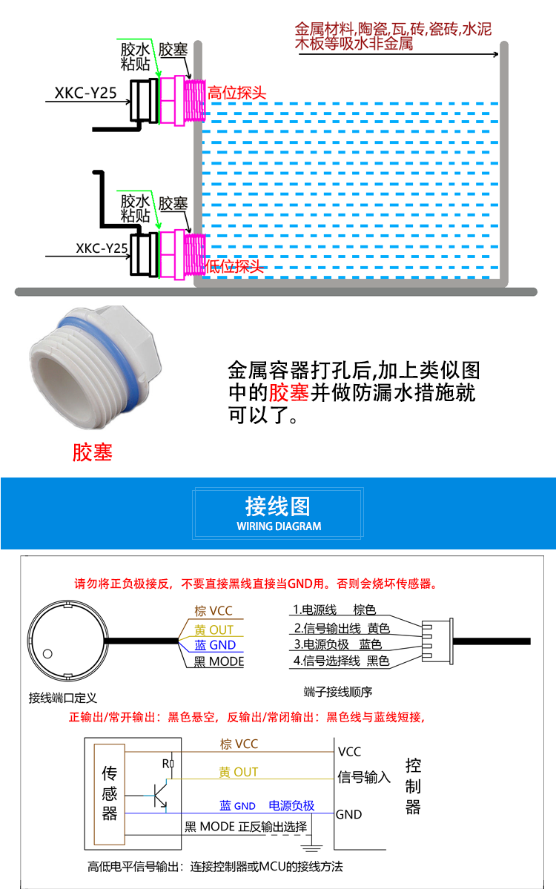
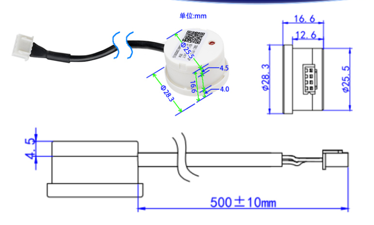

# SMO1095 Non-contact Water Liquid Level Sensor

https://www.electrodragon.com/product/non-contact-liquid-level-sensor/

## Use with metal containter
- need to drill hole(s) on the container
- install the rubber stopper with water-proof
- And sensor install on the back of the rubber stopper

## customized output 

- communication: TTL / switching NPN or PNP TTL / RS485 
- voltage 5-12V, 5-24V, 24V, 

| Model             | Output Type | Voltage Range | active |
| ----------------- | ----------- | ------------- | ------ |
| SMO1095-V         | V           | 5V–24V        |        |
| SMO1095-NPN       | NPN         | 5V–12V        | low    |
| SMO1095-PNP       | PNP         | 5V–12V        | high   |
| SMO1095-NPN-24V   | NPN         | 24V           | low    |
| SMO1095-PNP-24V   | PNP         | 24V           | high   |
| SMO1095-RS485     | RS485       | 5V–12V        |        |
| SMO1095-RS485 24V | RS485       | 24V           |        |

## Dimension 

## ref 

- [[smo1095]]