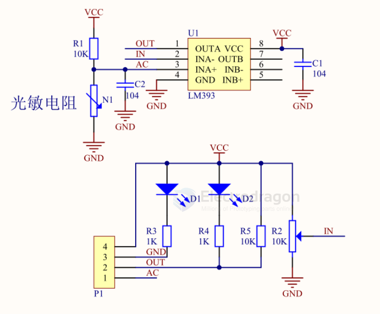
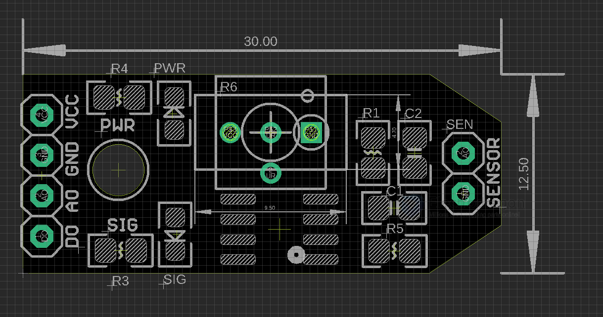

# SSL1003-dat

- legacy wiki page - https://w.electrodragon.com/w/Category:Light_Sensor
- board page - https://www.electrodragon.com/product/photoresistor-light-sensitive-module/
- sensor page - https://www.electrodragon.com/product/mini-photocell/

## board map and SCH 

## How to use:
- Photosensitive resistor module most sensitive to environmental light intensity is generally used to detect the ambient brightness and light intensity.
- Module light conditions or light intensity reach the set threshold, DO port output high, when the external ambient light intensity exceeds a set threshold, the module D0 output low;
- Digital output D0 directly connected to the MCU, and detect high or low TTL, thereby detecting ambient light intensity changes;
- Digital output module DO  can directly drive the relay module, which can be composed of a photoelectric switch;
- Analog output module AO and AD modules can be connected through the AD converter, you can get a more accurate light intensity values

## ref 

- [[LM393-dat]] 
  
- sensor - [[GL5528-dat]]