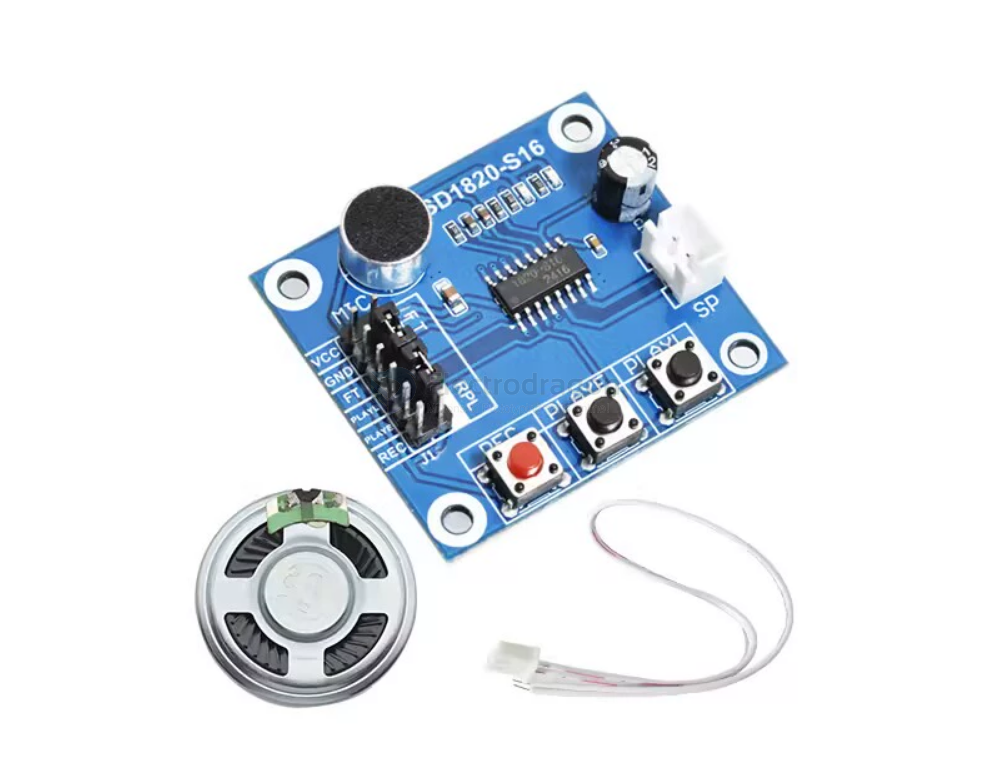
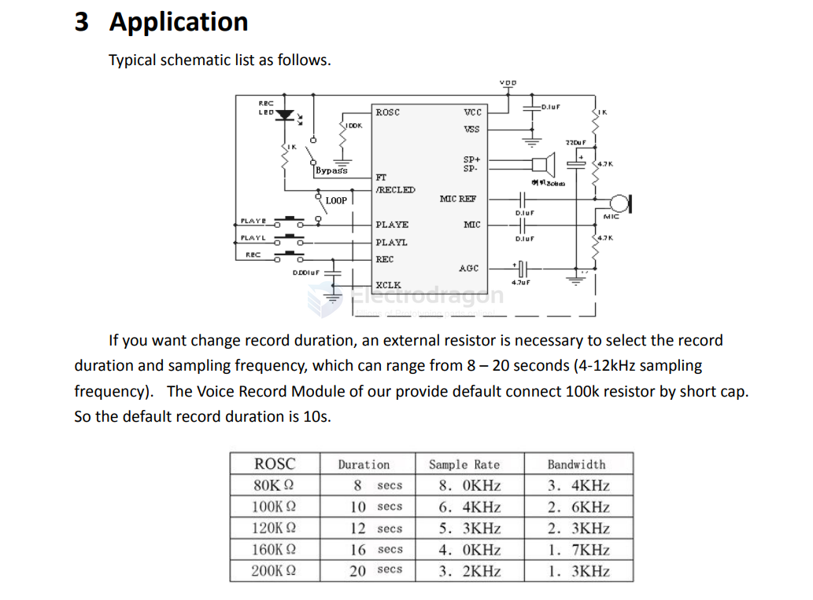

# SSL1008-dat

[ISD1820 Sound/Voice Recording/Playback/Recorder Module](https://www.electrodragon.com/product/isd1820-soundvoice-recording-playback-recorder-module-board/)

- [[ISD1820-dat]] == datasheet see here [[ISD1820Datasheet.pdf]].

- datasheet use guide 2 - [[isd1820-voice-recorder.pdf]]

The ISD1820 is a single-chip voice recording and playback device that can record up to 20 seconds of audio, with non-volatile storage, meaning recordings are retained even when power is off. 

Here's a more detailed breakdown:

- Functionality: It's designed for short-term audio recording and playback, suitable for applications like voice prompts, alarms, or simple audio messages. 
- Storage: The recordings are stored in non-volatile memory, meaning they are retained even when power is removed. 
- Recording Time: It can record up to 20 seconds of audio. 
- Playback: The module can be triggered to play back the recorded audio. 
- Control: The module can be controlled by push buttons or by a microcontroller. 
- Applications: Common applications include voice prompts, alarms, or simple audio messages. 
- Power Supply: The module typically operates on a 3V to 5V power supply 

## Scheamtic 

## ref 

- [[SSL1008]] - [[ISD-dat]]

- [legacy wiki page](https://w.electrodragon.com/w/Sound_Playback)

