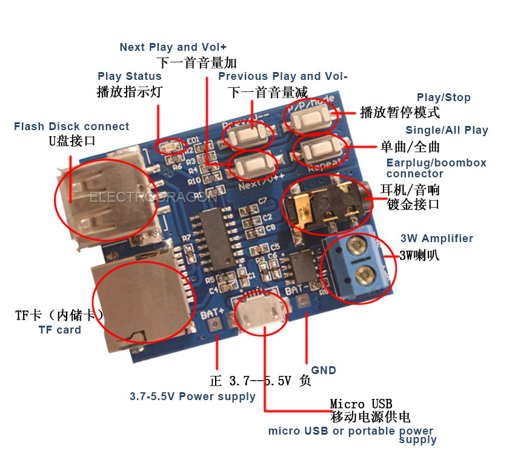
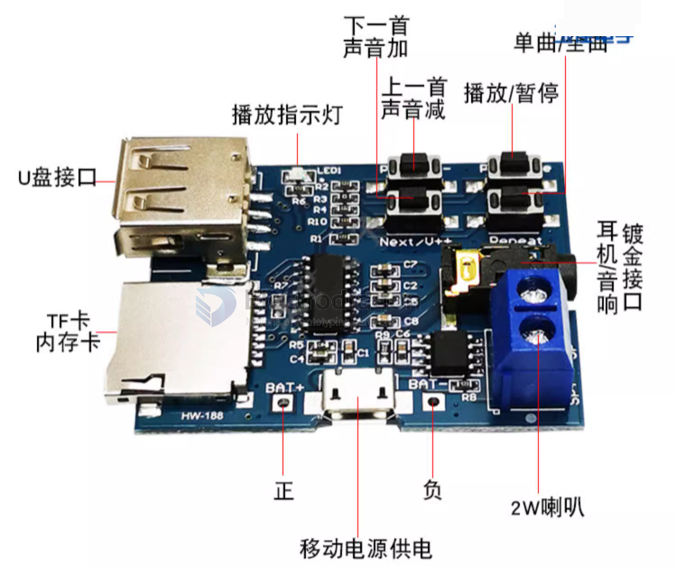

# SSL1014-dat

MP3 Decoder and Player Board, w/Amplifier

https://www.electrodragon.com/product/gpd2856c-mp3-decoder-and-play-board-wamplifier/

## ProductFeatures
- Supports MP3 format, automatically plays when powered on, and the red LED indicator light updates during playback status
- Supports U disk (32G tested) and TF card (16G tested) playback modes; the default is TF card mode when powered on. 
- If the IF card does not exist, it will automatically jump to IJ disk mode, and both devices are installed. You can manually Set the playback mode, please see the button operation instructions for details
- The buttons can adjust up and down track switching, volume +-, pause/play, and mode switching. Please see the button operation instructions for details.
- You can press the button to set the "single/full song" cycle. When powering on, the default is the full song cycle. Press the "Repeat" button to change the cycle mode.

## Board map 

- U盘接口 - u-disk port 
- TF卡 - TF flash disk
- 播放指示灯 - playback led indicator 
- 下一首/声音加 - next / volume up
- 上一首/声音减 - back / volume down 
- 播放/暂停 - play/pause
- 单曲/全曲 - single/loop-all
- 耳机/音响镀金接口 - earphone/sound-box port
- 移动电源供电 - poewrbank power supply 
- 2W 喇叭 - 2W amplifier
- 正 / 负 - battery + / -

## Button Operations
- "Prev / V--" button: "Press" for the switch "on a" song, "long press" is "volume Decrease"
- "Next / v ++" button: "Press" for the switch "next song" Song, "long press" is "volume increment"
- "P / P / Mode" button: "Press" for the "Play / Pause" switch, "long press" U-disk, TF card "pattern"
- "Repeat" button: "Press" for the "single / whole song" to cycle (no long press function)

Note:
- "Long press" for about 2S
- If you use U disk mode, it is recommended 5V power supply, and some U disk does not support 3.7V power supply.

## ref 

- [[mp3-decoder-dat]]

- [[SSL1014]]