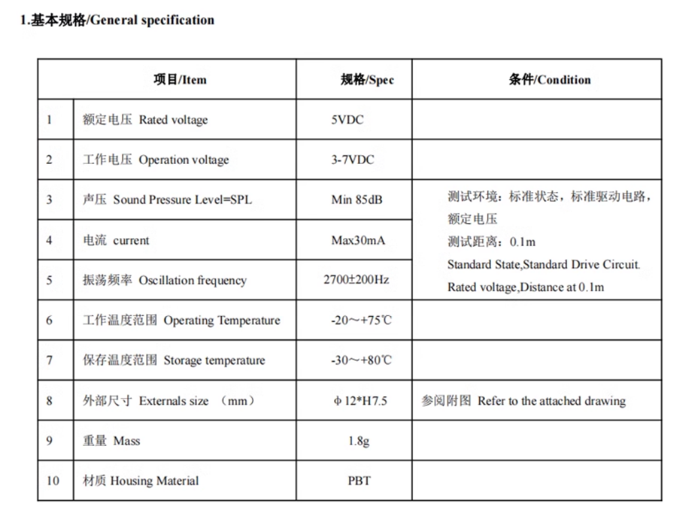
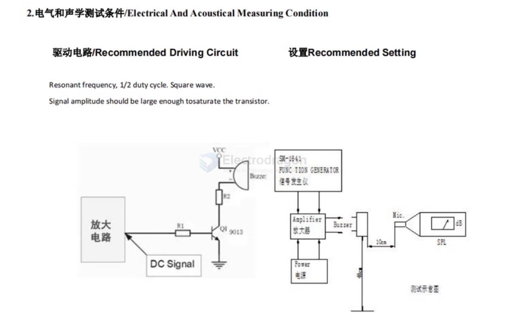
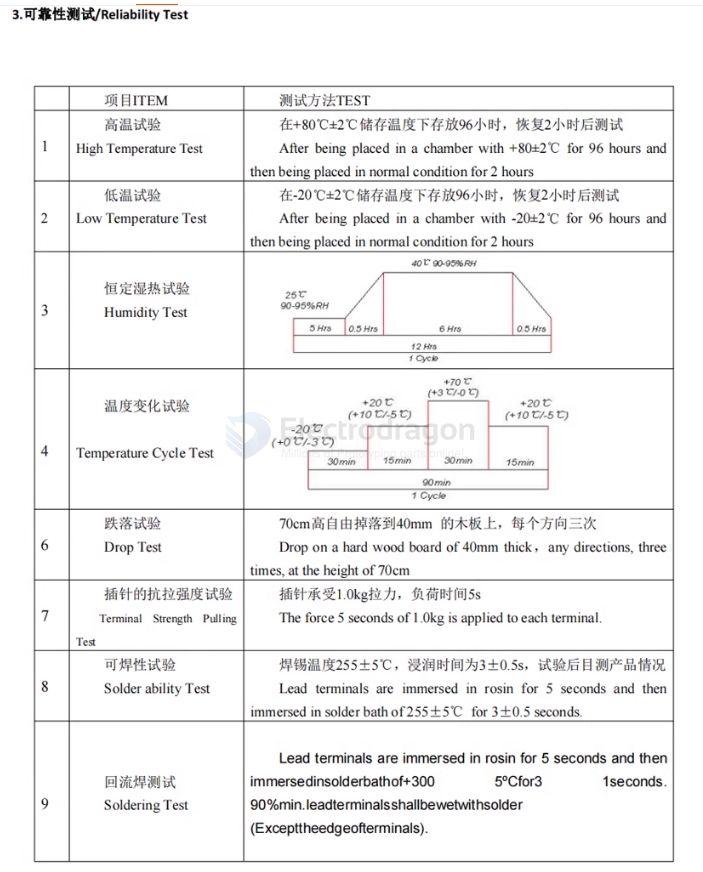
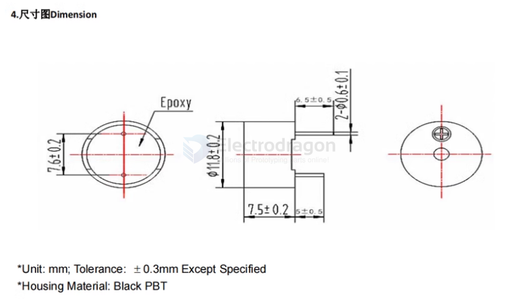
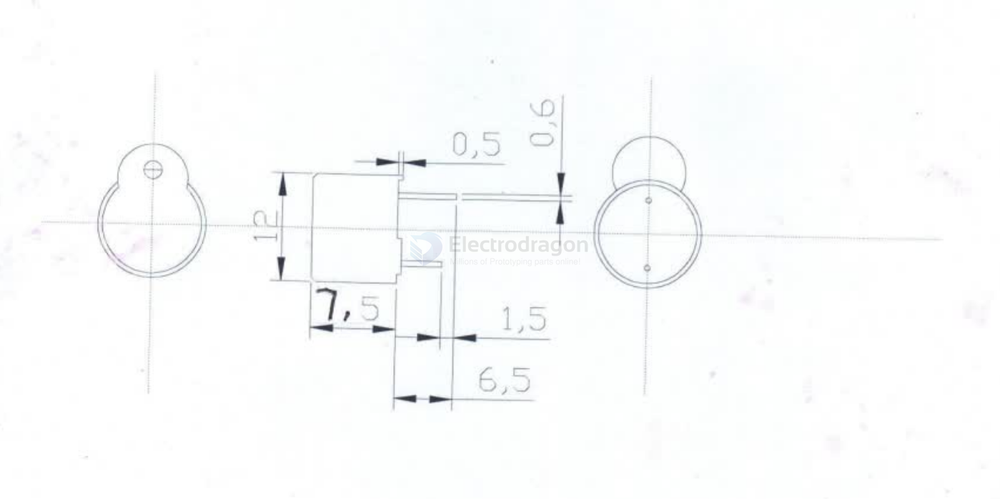
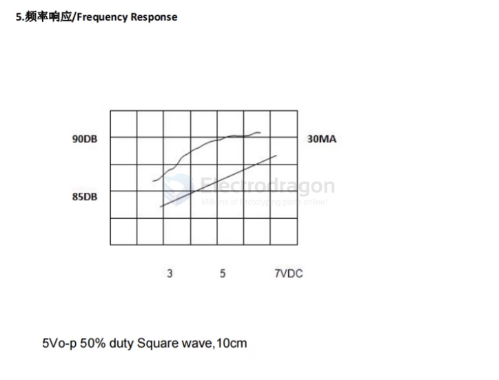
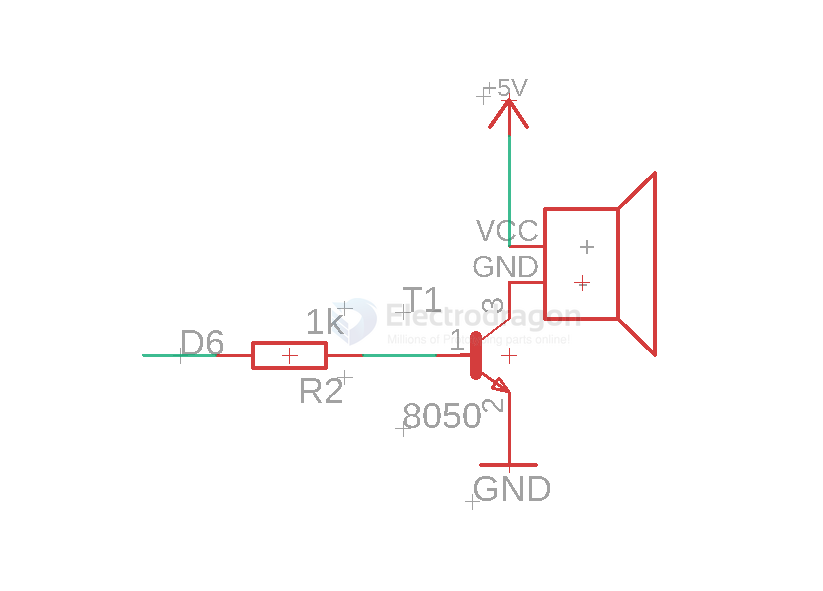

# SSL1019-dat

## Info
 
[product url - 5PCs 5V Active Continous Beeper/Buzzer](https://www.electrodragon.com/product/3v-active-buzzer-continous-beep-12095-type/)

== [[kicad-dat]] == Generic Buzzer, D12mm height 9.5mm with RM7.6mm

SPECIFICATION OF R/TMB12D05

FEATURES

- Seal with built-in
- Oscillating circuit fom wave
- Soldering and washing
- Case:black noryl

SPECIFICATIONS:

| TYPE                  | unit | R/TMB12D05 |
| --------------------- | ---- | ---------- |
| RATED VOLTAGE         | (V)  | 5        |
| OPERATING VOLTAGE     | (V)  | 3~7        |
| RATEDCURRENT          | (mA) | 30         |
| SOUND OUTPUT AT 10CM  | (dB) | ≥83        |
| RESONANT FREQUENCY    | (Hz) | 2800±500   |
| OPERATING TEMPERATURE | (C)  | -20~+80    |
| STORAGE TEMPERATURE   | (C)  | 25~+90     |
| WEIGHT                | (g)  | 2          |

注：焊锡温度：250℃时，5秒以内；350℃时2秒以内。

DIMENSION:(UNIT:mm)

### Board Map, Dimension, Pins, etc.
 
## Applications, category, tags, etc. 
 
## Demo Code and Video

## SCH 

- connect to D6 [[arduino-dat]]

## ref 

- [[acturator-dat]]
 
- [[SSL1019]] 
 
- legacy wiki page 
 

