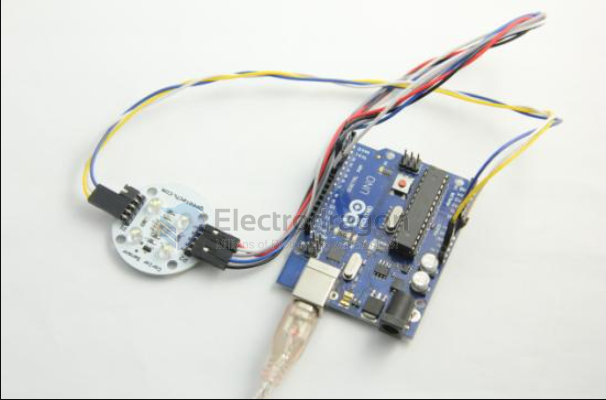
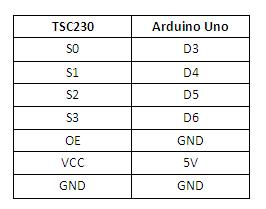
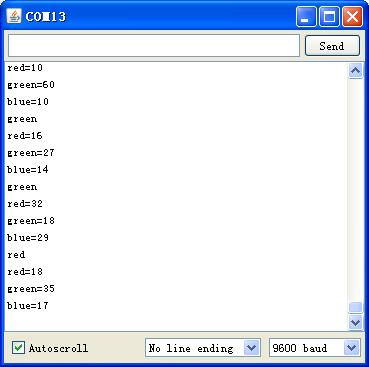

# SSL1037-dat

- order link - https://www.electrodragon.com/product/tcs230-tcs3200d-color-sensing-sensor-module-inlcuding-wide-angle-lens/

- old version - [[3201579-dat]] - https://www.electrodragon.com/product/arduino-color-recognition-sensor-tcs230-module-detector-for-mcuavr/

## Features 

1. Onboard TCS3200 color sensor

2. With [wide-angle lens], detachable, can identify large or small objects.

3. Support 3V-5V voltage input

4. All the pins of the chip have been brought out, and the pins are standard 100mil (2.54mm), which is convenient for dot matrix boards

5. With 4 high-brightness white LEDs, it can illuminate some objects that do not emit light by themselves. The light-emitting tube is controllable.

6. S1 S2 S3 S4 can be pulled up or down on the board.

7. There are 2 3mm mounting screw holes, with a spacing of 16.5mm

7. PCB size: 23mm X 30mm

## Wiring 

## Example code

* Get the necessary timerone library here TimerOne

code 

    #include <TimerOne.h>
    
    #define S0     6   // Please notice the Pin's define
    #define S1     5
    #define S2     4
    #define S3     3
    #define OUT    2
    
    int   g_count = 0;    // count the frequecy
    int   g_array[3];     // store the RGB value
    int   g_flag = 0;     // filter of RGB queue
    float g_SF[3];        // save the RGB Scale factor
    
    
    // Init TSC230 and setting Frequency.
    void TSC_Init()
    {
    pinMode(S0, OUTPUT);
    pinMode(S1, OUTPUT);
    pinMode(S2, OUTPUT);
    pinMode(S3, OUTPUT);
    pinMode(OUT, INPUT);
    
    digitalWrite(S0, LOW);  // OUTPUT FREQUENCY SCALING 2%
    digitalWrite(S1, HIGH); 
    }
    
    // Select the filter color 
    void TSC_FilterColor(int Level01, int Level02)
    {
    if(Level01 != 0)
        Level01 = HIGH;
    
    if(Level02 != 0)
        Level02 = HIGH;
    
    digitalWrite(S2, Level01); 
    digitalWrite(S3, Level02); 
    }
    
    void TSC_Count()
    {
    g_count ++ ;
    }
    
    void TSC_Callback()
    {
    switch(g_flag)
    {
        case 0: 
            Serial.println("->WB Start");
            TSC_WB(LOW, LOW);              //Filter without Red
            break;
        case 1:
            Serial.print("->Frequency R=");
            Serial.println(g_count);
            g_array[0] = g_count;
            TSC_WB(HIGH, HIGH);            //Filter without Green
            break;
        case 2:
            Serial.print("->Frequency G=");
            Serial.println(g_count);
            g_array[1] = g_count;
            TSC_WB(LOW, HIGH);             //Filter without Blue
            break;
    
        case 3:
            Serial.print("->Frequency B=");
            Serial.println(g_count);
            Serial.println("->WB End");
            g_array[2] = g_count;
            TSC_WB(HIGH, LOW);             //Clear(no filter)   
            break;
    default:
            g_count = 0;
            break;
    }
    }
    
    void TSC_WB(int Level0, int Level1)      //White Balance
    {
    g_count = 0;
    g_flag ++;
    TSC_FilterColor(Level0, Level1);
    Timer1.setPeriod(1000000);             // set 1s period
    }
    
    void setup()
    {
    TSC_Init();
    Serial.begin(9600);
    Timer1.initialize();             // defaulte is 1s
    Timer1.attachInterrupt(TSC_Callback);  
    attachInterrupt(0, TSC_Count, RISING);  
    
    delay(4000);
    
    for(int i=0; i<3; i++)
        Serial.println(g_array[i]);
    
    g_SF[0] = 255.0/ g_array[0];     //R Scale factor
    g_SF[1] = 255.0/ g_array[1] ;    //G Scale factor
    g_SF[2] = 255.0/ g_array[2] ;    //B Scale factor
    
    Serial.println(g_SF[0]);
    Serial.println(g_SF[1]);
    Serial.println(g_SF[2]);
    
    }
    
    void loop()
    {
    g_flag = 0;
    for(int i=0; i<3; i++)
        Serial.println(int(g_array[i] * g_SF[i]));
    delay(4000);
    
    }

## output 

## ref 

- [[color-sensor-dat]] - [[TCS230-dat]]

- [[SSL1037]]