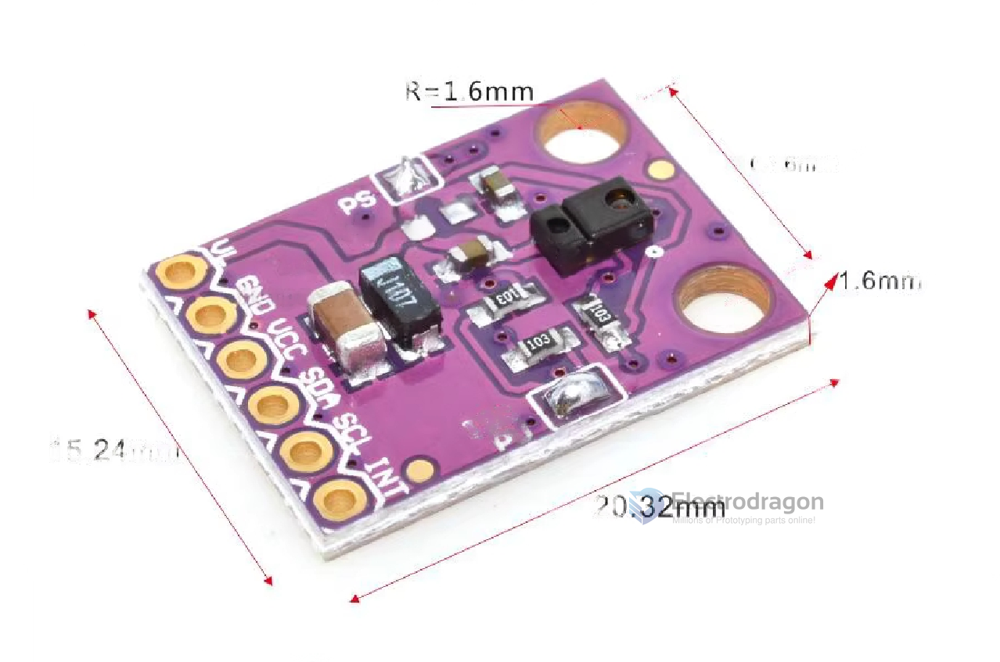
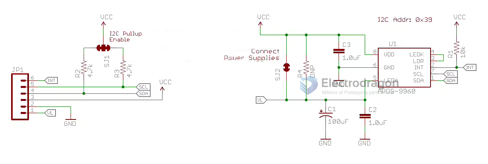

# SSL1045-dat

- [[APDS-9960-dat]]

https://www.electrodragon.com/product/apds9960-apds9930-sensor-breakout-board/

## Dimension 

- W = 15.24 
- installtion hole - 10.16

## SCH 

## ref cn 

APDS-9960 Gesture Recognition/Motion Direction Recognition Module

The APDS-9960 is an optical module integrated with ALS, infrared LED, and proximity detector, as well as an ambient light sensor (ALS, Ambient Light Sensing). It uses dual photodiodes to approximate 0.01 lux illumination, mimicking the human eye's visual response. It features programmable interrupt functions with upper and lower thresholds, up to 16-bit resolution, and can operate flexibly even behind dark glass. The proximity sensor is fully calibrated for 100mm object detection, eliminating the need for factory calibration of terminal devices and subcomponents. The dynamic range of ambient light has increased from the previous 10K lux to 30K lux, and solar calibration has significantly improved to 50K lux, greatly enhancing sensitivity and avoiding strong light interference. It can work precisely with an air gap of up to 1.0mm without requiring external isolation, greatly simplifying structural design for customers. Its standby power consumption is 90μA (typical), and sleep mode power is 2.2μA (typical), saving energy. With a dedicated interrupt pin supporting up to 400kHz (I2C fast mode) and I2C interface compatibility, this fully integrated solution facilitates structural and circuit design, offering users a better design experience and product value!

The built-in APDS-9960 sensor provides ambient light and color measurement, proximity detection, and non-contact gesture detection. With this RGB and gesture sensor, you can control a computer, microcontroller, or robot. It is far more powerful than a simple swipe function! In fact, the APDS-9960 gesture sensor was once used in the Samsung Galaxy S5.

It can be applied in ambient light and RGB color sensing, proximity detection, and gesture detection.

With four infrared sensors, you can measure the changes in light reflectivity at each basic position over time and convert these changes into gestures. Our interface library can detect directional gestures (left to right, right to left, top to bottom, bottom to top), but theoretically, more complex gestures such as zigzag, clockwise or counterclockwise circles, and near-to-far movements can also be achieved.

## ref 

- [[SSL1045]]