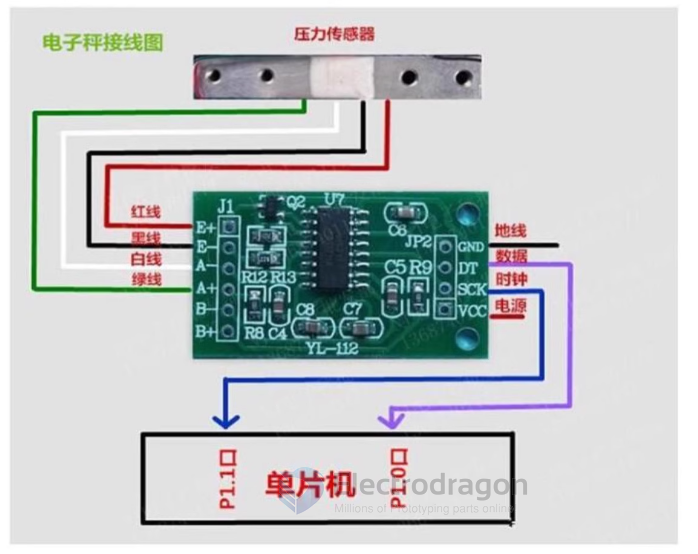
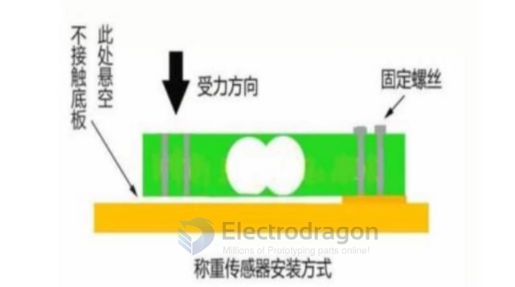
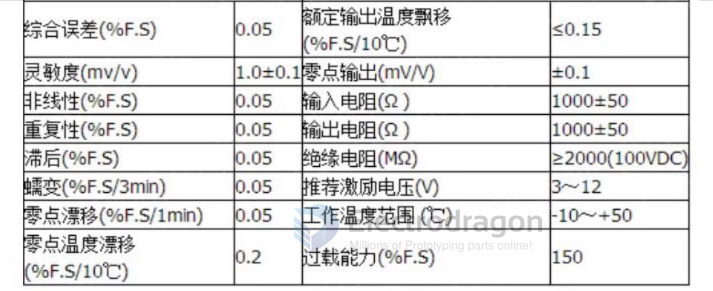

# SSL1070-dat

## Wiring 

## Installation 

## Specs 

## Wiring 

### Wiring from HX711 to load cell:

- Load cell sensor RED – HX711 E+
- Load cell sensor BLACK – HX711 E-
- Load cell sensor WHITE – HX711 A-
- Load cell sensor GREEN – HX711 A+

### Wiring of HX711 to MCU Pins:
- Gnd – power gorund
- DT – data output
- SCK – clock
- VCC power 2.7-5V

## Demo video

https://youtube.com/shorts/qNFiFE7YFlU?si=Xyuyxv-z5Z2szAh7

## ref 

- [[SSL1070]]