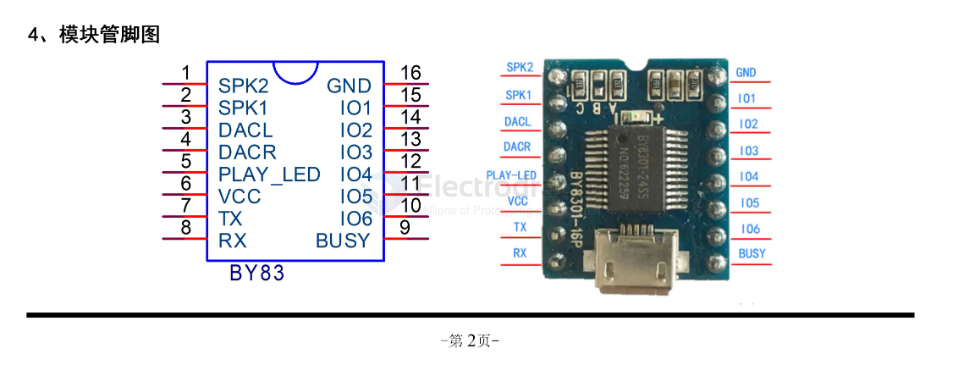

# SSL1075-DAT 

https://www.electrodragon.com/product/edmp3-mp3-playback-module/

https://w.electrodragon.com/w/Category:EDMP3

## Info 

BY83 is a compact new high-quality MP3 module independently developed by us. It adopts QS0P24MP3 main control chip and supports dual decoding of MP3 and WAV formats. 

The module has built-in SPI-FLASH as storage medium and is equipped with MicrocUSB interface. No host computer software is required. 

The audio content of FLASH can be freely changed by connecting to the computer through a data cable. 

And it has a built-in 3W amplifier, which can directly drive a 3W speaker, making it more convenient to use.

## Product Features
- Support MP3, WAV high-quality audio formats, beautiful sound.
- 24-bit DAC output, dynamic range supports 90dB, signal-to-noise ratio supports 85dB.
- MicroUSB interface updates voice files, no need to install host computer software. Support XP and WIN7 systems.
- Support 21-segment voice one-to-one trigger playback, 310-port hardware selects 8 trigger modes, and is more widely used.
- Support UART asynchronous serial port control: support play, pause, up and down songs, volume increase and decrease, song selection, advertising insertion, etc.
- Built-in volume, track, EQ power-off memory function.
- Support 0-16M byte capacity SPIFLASH. For example, GD25Q32 [4M bytes], GD25Q64 [8M bytes]
- With a 3W amplifier, you can play directly by connecting an external speaker; customers can also connect single-channel and dual-channel amplifiers.
- Standard 2.54mm pitch DIP16 pin package, small and beautiful.

## Technical specifications
| Specs                    | info                                                                                                                           |
| ------------------------ | ------------------------------------------------------------------------------------------------------------------------------ |
| MP3 and WAV file formats | support audio files with sampling rates of 8 to 48K and bit rates of 8 to 320Kbps                                              |
| USB interface            | 2.0 standard (MicroUSB interface, can be connected to a computer to download voice and read USB disk content)                  |
| UART interface           | standard serial port, 3.3VTTL level, baud rate 9600                                                                            |
| Input voltage            | 3.6V-5V (5V is the maximum limit, recommended value 4.2V, chip power supply is recommended to be connected with a diode at 5V) |
| Quiet current            | 15MA (entire module)                                                                                                           |
| Amplifier power          | connects to 2W/4Q or 1W/8Q or above speakers                                                                                   |
| Size                     | 21mm*18mm                                                                                                                      |
| Operating temperature    | -40°℃~70°℃                                                                                                                     |
| Humidity                 | 5%~95%                                                                                                                         |

## Module dimension 

## Pin definitions 

| Pin number | Pin name | Function description                                              | Remarks                                                                                                        |
| ---------- | -------- | ----------------------------------------------------------------- | -------------------------------------------------------------------------------------------------------------- |
| 1          | SPK2     |
| 2          | SPK1     | External mono passive speaker                                     | Connect 2W/4Q or 1W/8Q or above speakers at both ends                                                          |
| 3          | DACR     | DAC right channel output                                          | can be connected to external amplifier, headphones                                                             |
| 4          | DACL     | DAC left channel output                                           | can be connected to external amplifier, headphones                                                             |
| 5          | PLAY_LED | playback indicator, always on when stopped, flashing when playing | output high level, LED negative pole grounded                                                                  |
| 6          | VCC      | power supply positive pole                                        | 3.6-5V                                                                                                         |
| 7          | TX       | UART asynchronous serial port data output                         | 3.3V TTL level                                                                                                 |
| 8          | RX       | UART asynchronous serial port data input                          | 3.3V TTL level                                                                                                 |
| 9          | BUSY     | outputs high level when playing, and low  when stopping           | busy signal                                                                                                    |
| 10         | I06      | trigger input port 6                                              | ground trigger                                                                                                 |
| 11         | IO5      | trigger input port 5                                              | ground trigger                                                                                                 |
| 12         | I04      | trigger input port 4                                              | ground trigger                                                                                                 |
| 13         | I03      | trigger input port 3                                              | ground trigger                                                                                                 |
| 14         | I02      | trigger input port 2                                              | ground trigger                                                                                                 |
| 15         | IO1      | trigger input port 1                                              | ground trigger                                                                                                 |
| 16         | GND      | power supply negative pole                                        | system ground, when connected to a high-power amplifier, large current should not flow through this ground pin |

## ref 

- [[SSL1075]]