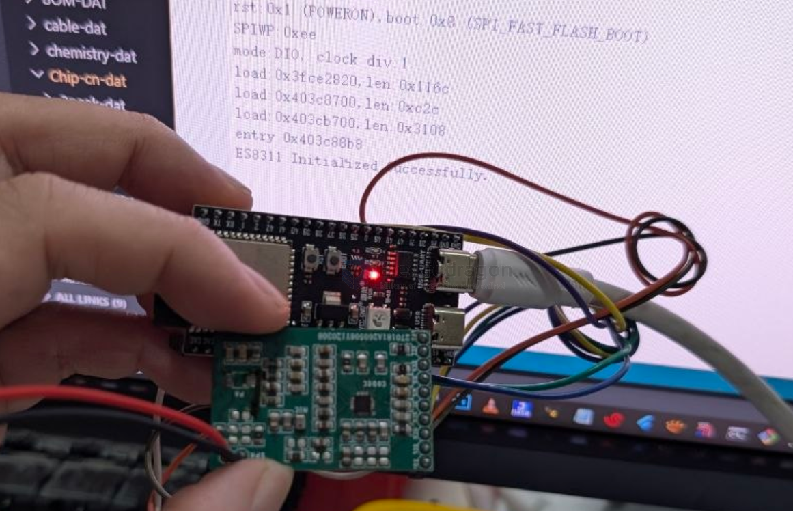

# SSL1080-dat

## Info

product url - 

### Board Map, Dimension, Pins, chip info, Use Guide, Setup Jumper, etc.

- [[ES8311-SDK-dat]] - [[ES8311-dat]] - [[everest-semi-dat]] - [[ES7201-dat]] - [[codec-audio-dat]] - [[I2S-dat]]

- [[NS4150-dat]] - [[NSIWAY-dat]]

    GND  
    VCC  
    3V3

    DO == 6 
    WS == 4 
    DI  
    SCK == 5 
    MCK == 2

    SCL == 19
    SDA == 18

## Applications, category, tags, etc. 

    // 1. Define your pins clearly
    #define I2S_BCLK 5
    #define I2S_LRCK 4
    #define I2S_DOUT 6
    #define I2S_MCLK 2
    
    #define I2C_SDA 18
    #define I2C_SCL 19

## Demo Code and Video

## ref 

- [[SSL1080]] 

- legacy wiki page 
