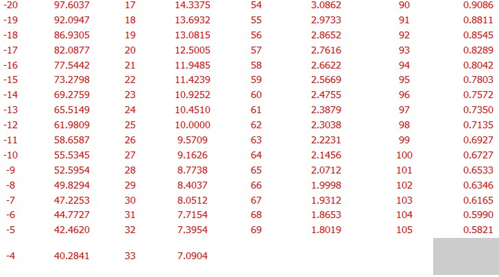

# STH1007-dat

## Info 
 
[product url](https://www.electrodragon.com/product/ntc-thermistor-probe-10k-1-temperature-sensor/)

## Applications, category, tags, etc. 

- [[sensor-temperature-dat]]

## Specs 

Product specifications: NTC 10k accuracy ±1% 3950 parallel lines

Wire length 1 meter, wire end pressure XH2.54 terminal

Probe copper shell: 5*30MM

## ref 
 
- [[]] 
 
- legacy wiki page 
 

