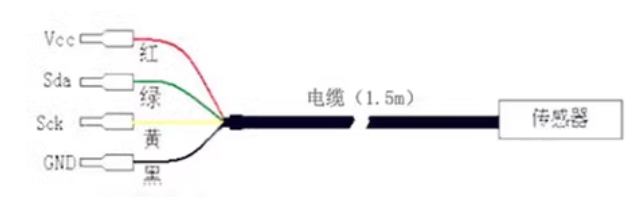

# STH1016-dat

- internal SHT30 I2C output 

## Main Features: 

Four-core connector, easy to replace and maintain. If the accuracy is insufficient, the sensor can be replaced at any time.

Usage: The probe can be directly buried in the soil.

## Info 
 
[product url](https://www.electrodragon.com/product/soil-temperaturemoisture-sensor-probe-sht10/)

## Product Features:

- Digital, resolution up to 14 bits
- Internal self-calibration, no calibration required.
- Temperature and humidity are closely integrated for easy dew point measurement
- High reliability and long-term stability
- The product structure is exquisite and suitable for on-site applications and product integration

## Application range:

## Application range:

*   Computer room monitoring
*   HVAC
*   Weather station
*   Warehouse
*   Construction site
*   Concrete test block detection
*   Agricultural greenhouse
*   Flower Nursery

Data loggers, transmitters, automated process control, construction sites, agricultural greenhouses, flowers, nurseries, lawns, and other environments where soil temperature and humidity need to be measured. The metal-encased form factor is more suitable for use in environments with significant dust and harsh conditions.

## Selection Guide:

FS200— SHT （2） — （3）

## resolutions 

| Swiss Digital Sensor | Humidity Accuracy | Temperature Accuracy | Supply Voltage | Notes         |
| -------------------- | ----------------- | -------------------- | -------------- | ------------- |
| SHT10                | 4.5%              | 0.5℃                 | 5.0V    DC     | FS100.200.300 |
| SHT11                | 3%                | 0.5℃                 | 5.0V    DC     | FS100.200.300 |
| SHT15                | 2%                | 0.5℃                 | 5.0V    DC     | FS100.200.300 |
| SHT20                | 3%                | 0.5℃                 | 3.3V    DC     | FS200.300     |
| SHT21                | 2%                | 0.5℃                 | 3.3V    DC     | FS200.300     |
| SHT25                | 1.8%              | 0.5℃                 | 3.3V    DC     | FS200.300     |
| SHT71                | 3%                | 0.5℃                 | 5.0V    DC     | FS200.300     |
| SHT75                | 1.8%              | 0.5℃                 | 5.0V    DC     | FS200.300     |

## Output Method:

- I: I2C output 
- R: RS485 output (FS300 does not have this option)

## Technical Parameters:

- Operating Voltage: 3.3-5V
- Operating Current: ≤15mA
- Measurement Range: Temperature: -20℃～100℃
- Humidity: 0～100％RH
- Operating Environment Conditions: -20℃～90℃, 0～99％RH
- Storage Environment Conditions: -20℃～80℃, 0～95％RH

## Wiring 

- Red: power supply (Vcc)
- Green: Serial Data (Sda)
- Huang: Serial Clock (Sck)
- Black: ground (GND)

## Code 

- [arduino](https://github.com/practicalarduino/SHT1x) 

SHT1x :

- 7x (analog IIC) are program-interchangeable 
- SHT2x (standard IIC) which is not program-interchangeable.

## ref 

- [[SHT30-dat]] - [[STH10-dat]]

- [[STH1016]]