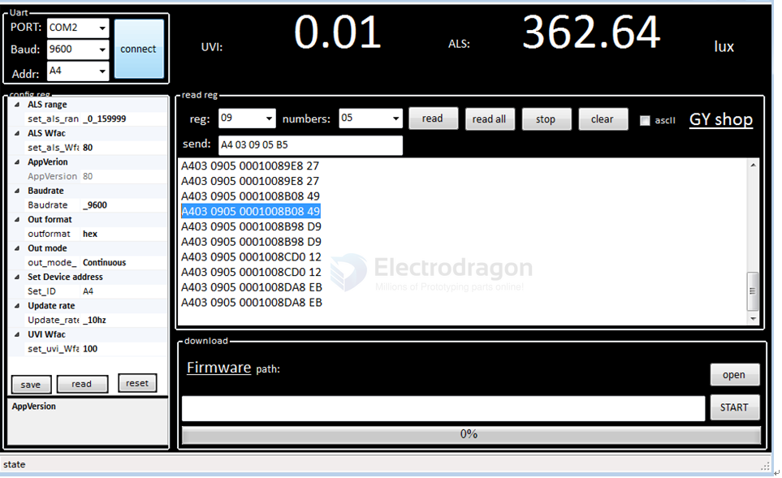

# STH1023-dat

- [[VEML6070-dat]] - [[sensor-UV-light-dat]]


This tutorial will help you quickly understand and use the STH1023 UV/light sensor module. It covers register settings, serial communication, and example commands in clear English.

---

## 1. Register Map

| Address | Name           | Description                                                                                 | Default |
|---------|----------------|--------------------------------------------------------------------------------------------|---------|
| 0x00    | Device ID      | 1~254; 0=broadcast; default 0xA4 (must be even, matches 8-bit I2C address)                | 0xA4    |
| 0x01    | Baud Rate      | 0~8: 2400, 4800, 9600, 19200, 38400, 57600, 115200, 230400; default 9600                  | 9600    |
| 0x02    | Update Rate    | 0:1Hz; 1:5Hz; 2:10Hz; default 10Hz                                                         | 10Hz    |
| 0x03    | Output Mode    | 0: Continuous (default); 1: Query                                                          | 0       |
| 0x04    | Output Format  | 0: Hex (default); 1: Character                                                            | 0       |
| 0x05    | Save Settings  | 0x55: Save config; 0xAA: Factory reset                                                     |         |
| 0x06    | Analog Range   | 0: 0~49999lux; 1: 50000~99999lux; 2: 100000~159999lux; 3: 0~159999lux (default)            | 3       |
| 0x07    | ALS_Wfac       | 0~256: 0~2.56; brightness glass factor (value × 100)                                       |         |
| 0x08    | UVI_Wfac       | 0~256: 0~2.56; UV glass factor (value × 100)                                               |         |
| 0x09    | UVI_H_data     | UVI = (UVI_H_data << 8 | UVI_L_data) / 100                                                 |         |
| 0x0A    | UVI_L_data     | See above                                                                                  |         |
| 0x0B    | ALS_H_data     | Lux = (ALS_H_data << 16 | ALS_M_data << 8 | ALS_L_data) / 100                             |         |
| 0x0C    | ALS_M_data     | See above                                                                                  |         |
| 0x0D    | ALS_L_data     | See above                                                                                  |         |
| 0x0E    | Firmware Info  | 0~255                                                                                      |         |

---

## 2. Serial Communication

### Frame Structure

| Address | Function | Data | Checksum |
|---------|----------|------|----------|
| 1 byte  | 1 byte   | N    | Low 8 bits of sum |

### Supported Functions

| Function         | Code  |
|------------------|-------|
| Write Register   | 0x06  |
| Read Register    | 0x03  |

### Response Time

| Baud Rate | Response |
|-----------|----------|
| 9600      | ~10ms    |
| 115200    | ~1ms     |

---

## 3. Example Commands

### Set Baud Rate to 115200

Send:
```
A4 06 01 06 B1
```
| A4 | 06 | 01 | 06 | B1 |
|----|----|----|----|----|
| Addr | Write | Reg | Data | Checksum |

Response:
```
A4 06 01 06 B1
```

### Set Update Rate to 10Hz

Send:
```
A4 06 02 02 AE
```
| A4 | 06 | 02 | 02 | AE |
|----|----|----|----|----|
| Addr | Write | Reg | Data | Checksum |

Response:
```
A4 06 02 02 AE
```

### Read Registers

Send:
```
A4 03 09 05 B5
```
| A4 | 03 | 09 | 05 | B5 |
|----|----|----|----|----|
| Addr | Read | Start Reg | Count | Checksum |

Response Example:
```
A4 03 09 05 0001008B08 49
```
| A4 | 03 | 09 | 05 | [Values] | 49 |
|----|----|----|----|----------|----|
| Addr | Read | Start Reg | Count | Data | Checksum |

---

## 4. Output Modes

### Continuous Output
1. Set output mode register (0x03) to 0.
2. Send read data frame (set start register and count).

### Query Output
1. Set output mode register (0x03) to 1.
2. Send read data frame each time you want data.

*Note: Output format is set by the read data frame. Mode is set by register 0x03.*

---

## 5. PC Software Usage




- Use [[GY_UVI.zip]] for Windows.
- Select the COM port connected to the module, baud rate, and ID (default 0xA4, or 0x00 if unknown).
- **Config reg:** This section corresponds to configurable registers. After changing any register, press Enter or click elsewhere to write the config to the module.
- **Read reg:** This section is for reading module registers. Set the start register and number of registers to read, then click "read" to send the command.

### Continuous Mode
1. Set start register and number of registers to read.
2. Set update rate.
3. Set mode to continuous.

### Query Mode
1. Set start register and number of registers to read.
2. Set update rate.
3. Set mode to query.
4. For each query, repeat step 1 (send read register frame).

---

## 6. Arduino Example

- See [[arduino_usart.ino]] for sample code.

---

## Related

- [[VEML6070-dat]]
- [[sensor-UV-light-dat]]
d:每次查询，进行一次a步骤，即每次发送读寄存器指令帧；


## arduino 

- [[arduino_usart.ino]]