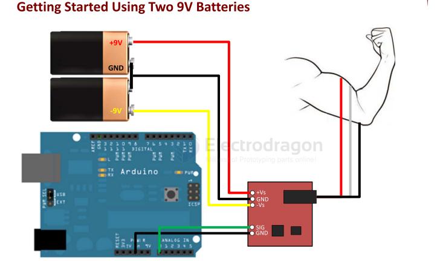
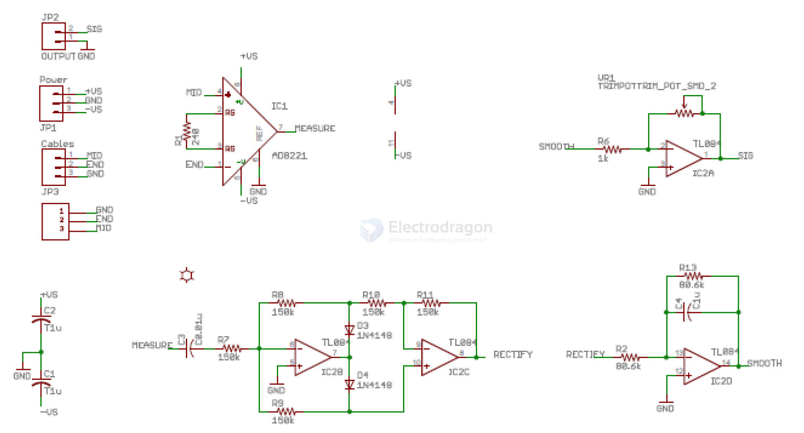
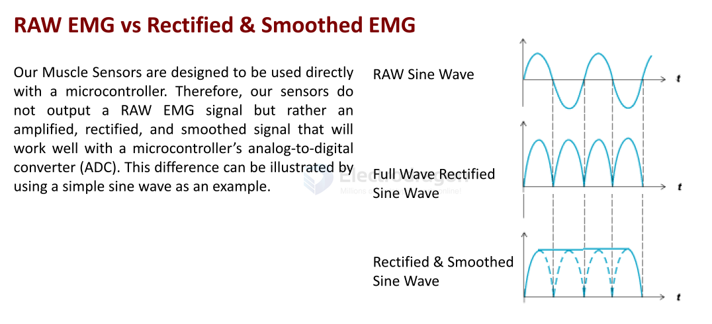

# STH1029-dat

## board 

[Heart Rate Monitor, ECG, Single Lead, AD8232](https://www.electrodragon.com/product/single-lead-heart-rate-monitor-ad8232/)

## info 

- [[AD8232-dat]]

[[sensor-bio-ECG-dat]] - [[sensor-bio-heart-rate-dat]] - [[sensor-bio-dat]]

FEATURES
- Small Form Factor (1inch X 1inch)
- Specially Designed For Microcontrollers
- Adjustable Gain – Improved Ruggedness
- New On‐board 3.5mm Cable Port
- Pins Fit Easily on Standard Breadboards

APPLICATIONS
- Video games
- Robots
- Medical Devices
- Wearable/Mobile Electronics
- Powered Exoskeleton suits

What is electromyography?

Measuring muscle activation via electric potential, referred to as electromyography (EMG), has
traditionally been used for medical research and diagnosis of neuromuscular disorders. However,
with the advent of ever shrinking yet more powerful microcontrollers and integrated circuits, EMG
circuits and sensors have found their way into prosthetics, robotics and other control systems.

1) Connect the power supply (two 9V batteries)
- a. Connect the positive terminal of the first 9V battery to the +Vs pin on your sensor.
- b. Connect the negative terminal of the first 9V battery to the positive terminal of the  second 9V battery. Then connect to the GND pin on your sensor.
- c. Connect the negative terminal of the second 9V battery to the –Vs pin of your sensor.

2) Connect the electrodes
- a. After determining which muscle group you want to target (e.g. bicep, forearm, calf),  clean the skin thoroughly.
- b. Place one electrode in the middle of the muscle body, connect this electrode to the  RED Cable’s snap connector.
- c. Place a second electrode at one end of the muscle body, connect this electrode to  the Blue Cable’s snap connector. 
- d. Place a third electrode on a bony or non‐muscular part of your body near the  targeted muscle, connect this electrode to the Black Cable’s snap connector.

3) Connect to a Microcontroller (e.g. Arduino)
- a. Connect the SIG pin of your sensor to an analog pin on the Arduino (e.g. A0)
- b. Connect the GND pin of your sensor to a GND pin on the Arduino.

- [[TL08-dat]] - [[amplifier-dat]]

## Electrical Specifications

| Parameter                                    | Min             | TYP             | Max              |
| -------------------------------------------- | --------------- | --------------- | ---------------- |
| Power Supply Voltage (Vs)                    | ±3V             | ±5V             | ±30V             |
| Gain Setting, Gain = 207*(X /1 kΩ)           | 0.01 Ω (0.002x) | 50 kΩ (10,350x) | 100 kΩ (20,700x) |
| Output Signal Voltage (Rectified & Smoothed) | 0V              | -               | +Vs              |
| Differential Input Voltage                   | 0 mV            | 2-5 mV          | +Vs/Gain         |

## EMG 

## AD8232 Sensor Module

### Single-Lead Heart Rate Monitoring Front-End

AD8232 is an integrated front-end designed for signal conditioning of cardiac bioelectric signals for heart rate monitoring.

It is an integrated signal conditioning module for ECG and other bioelectric measurement applications. The device is designed to extract, amplify, and filter weak bioelectric signals in the presence of noise from motion or remote electrode placement. This design allows ultra-low power analog-to-digital converters (ADC) or embedded microcontrollers to easily acquire the output signal.

AD8232 uses a two-pole high-pass filter to eliminate motion artifacts and electrode half-cell potentials. This filter is tightly coupled with the instrumentation amplifier structure to achieve single-stage high gain and high-pass filtering, thereby saving space and cost.

AD8232 uses an unconstrained operational amplifier to create a three-pole low-pass filter, eliminating additional noise. Users can select the cutoff frequencies of all filters to meet the needs of different types of applications.

To improve the common-mode rejection performance of system line frequency and other unwanted interference, AD8232 has a built-in amplifier for driven lead applications such as right leg drive (RLD).

AD8232 includes a fast recovery feature that reduces the long settling tail of the high-pass filter. If the amplifier rail voltage experiences a signal glitch (such as lead-off), AD8232 will automatically adjust to a higher filter cutoff state. This feature allows AD8232 to achieve fast recovery, thus obtaining valid measurements as soon as possible after the leads are connected to the subject's electrodes.

The guaranteed performance temperature range is 0°C to 70°C, and the operating temperature range is -40°C to +85°C.

### Applications

- Fitness and sports heart rate monitoring
- Portable [[sensor-bio-ECG-dat]]
- Remote health monitoring
- Gaming peripherals
- Bioelectric signal acquisition

### Pin Descriptions

| Number | Name        | Description                                                                                                                                                                                                                                                 |
| ------ | ----------- | ----------------------------------------------------------------------------------------------------------------------------------------------------------------------------------------------------------------------------------------------------------- |
| 1      | HPDRIVE     | High-pass driver output. HPDRIVE should be connected to the capacitor in the first high-pass filter. AD8232 drives this pin to keep HPSENSE at the same level as the reference voltage.                                                                     |
| 2      | +IN         | Instrumentation amplifier positive input. +IN is typically connected to the left arm (LA) electrode.                                                                                                                                                        |
| 3      | −IN         | Instrumentation amplifier negative input. −IN is typically connected to the right arm (RA) electrode.                                                                                                                                                       |
| 4      | RLDFB       | Right leg drive feedback input. RLDFB is the feedback pin for the right leg drive circuit.                                                                                                                                                                  |
| 5      | RLD         | Right leg drive output. The drive electrode (usually right leg) should be connected to the RLD pin.                                                                                                                                                         |
| 6      | SW          | Fast recovery switch pin. This pin should be connected to the output of the second high-pass filter.                                                                                                                                                        |
| 7      | OPAMP+      | Operational amplifier non-inverting input.                                                                                                                                                                                                                  |
| 8      | REFOUT      | Reference voltage buffer output. The instrumentation amplifier output references this potential. REFOUT should be used as a virtual ground for any point in the circuit that requires a reference signal.                                                   |
| 9      | OPAMP−      | Operational amplifier inverting input.                                                                                                                                                                                                                      |
| 10     | OUT         | Operational amplifier output. This output provides the fully conditioned heart rate signal. OUT can be connected to the input of an ADC.                                                                                                                    |
| 11     | LOD−        | Lead-off comparator output. In DC lead-off detection mode, LOD− is high when disconnected from the −IN electrode, otherwise low. In AC lead-off detection mode, LOD− is always low.                                                                         |
| 12     | LOD+        | Lead-off comparator output. In DC lead-off detection mode, LOD+ is high when disconnected from the +IN electrode, otherwise low. In AC lead-off detection mode, LOD+ is high when either −IN or +IN electrode is disconnected, low when both are connected. |
| 13     | SDN         | Shutdown control input. Driving SDN low enters low-power shutdown mode.                                                                                                                                                                                     |
| 14     | AC/DC       | Lead-off mode control input. For DC lead-off mode, drive AC/DC low. For AC lead-off mode, drive AC/DC high.                                                                                                                                                 |
| 15     | FR          | Fast recovery control input. Driving FR high enables fast recovery mode; otherwise, drive it low.                                                                                                                                                           |
| 16     | GND         | Power ground.                                                                                                                                                                                                                                               |
| 17     | +VS         | Power supply pin.                                                                                                                                                                                                                                           |
| 18     | REFIN       | Reference voltage buffer input. REFIN (high impedance input) can be used to set the level of the reference voltage buffer.                                                                                                                                  |
| 19     | IAOUT       | Instrumentation amplifier output pin.                                                                                                                                                                                                                       |
| 20     | HPSENSE     | Instrumentation amplifier high-pass sense input. HPSENSE should be connected to the R and C node that sets the high-pass filter corner frequency.                                                                                                           |
| EP     | Exposed Pad | Exposed pad. The exposed pad should be connected to GND or left unconnected.                                                                                                                                                                                |

## demo code 

- [[bitalino-android-example-master.zip]] - [[MuscleSensor_Arduino.zip]] - [[MuscleSensor_Processing.zip]]

## ref 

- [[AD8232-dat]]