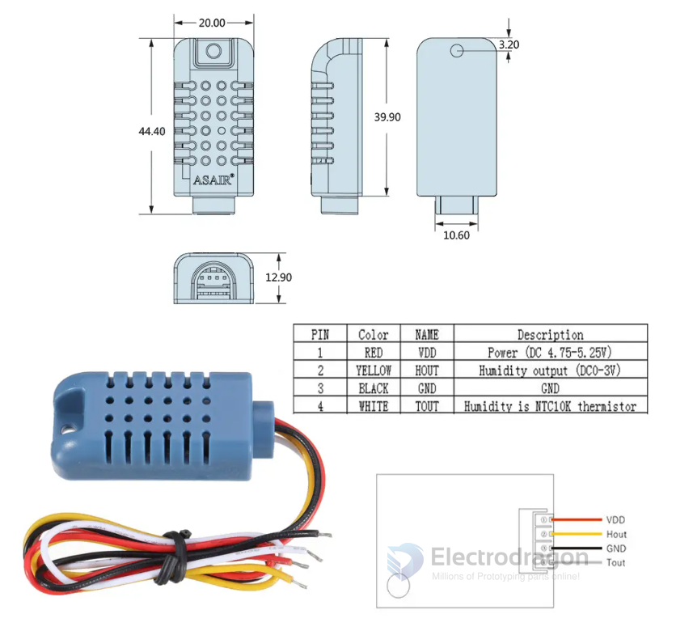
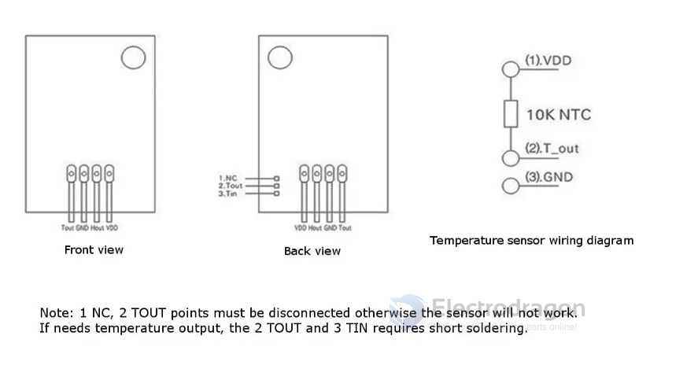

# STH1033-dat

## wiring and dimension 

温度：-40~+80°℃
湿度：0~99.9%RH
精度：±0.3C/±3%RH

## AM1011A — Upgraded Humidity & Temperature Sensor (English)

AM1011A is an upgraded sensor featuring a dedicated ASIC, a high-performance silicon-based capacitive humidity sensor, and an on-chip temperature sensor. It provides an analog voltage output (0–3 V). Improvements over the previous generation include better stability in high-temperature/high-humidity environments, improved accuracy, faster response time, and a wider measurement range. Each unit is factory-calibrated and tested for reliable mass deployment.

### Key specifications

| Item | Specification |
|---|---|
| Model | AM1011A |
| Power supply | DC 4.75–5.25 V |
| Output signal | 0–3 V analog voltage |
| Sensing element | Silicon-based capacitive humidity sensor + on-chip temperature sensor (NTC) |
| Measurement range | Temperature: -40 to +80 °C; Humidity: 0 to 99.9 %RH |
| Temperature accuracy | Typical: ±0.3 °C (note: some documentation lists NTC accuracy as ±1 %) |
| Humidity accuracy | ±3 %RH (typical) |
| Temperature resolution | 1 °C |
| Humidity resolution | 0.1–1 %RH (specs vary; repeatability listed below) |
| Repeatability | Temperature: ±1 °C; Humidity: ±1 %RH |
| Humidity hysteresis | ±1 %RH |
| Long-term stability | ±1 %RH per year |
| Response time | Temperature: ~6 s; Humidity: <8 s (to 63% step) |
| Temperature output | 10 kΩ NTC (for temperature measurement) |
| Housing material | ABS + PC plastic |
| Power consumption | ~1.5 mA |
| Weight | ~9.2 g |

Notes:
- The product description mentions both a typical temperature accuracy of ±0.3 °C and an NTC-based accuracy listed as ±1 % in some documents — include the source datasheet for definitive values.
- AM1011A provides an analog interface; for combined humidity+temperature modules with digital outputs see AMT1001 datasheet.

## ref 

- [[AMT1001-DS.pdf]]

- [[sensor-temperature-dat]]

- [[STH1033]]

- legacy wiki page - - https://w.electrodragon.com/w/AMT1001

