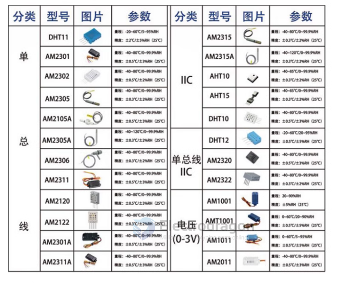
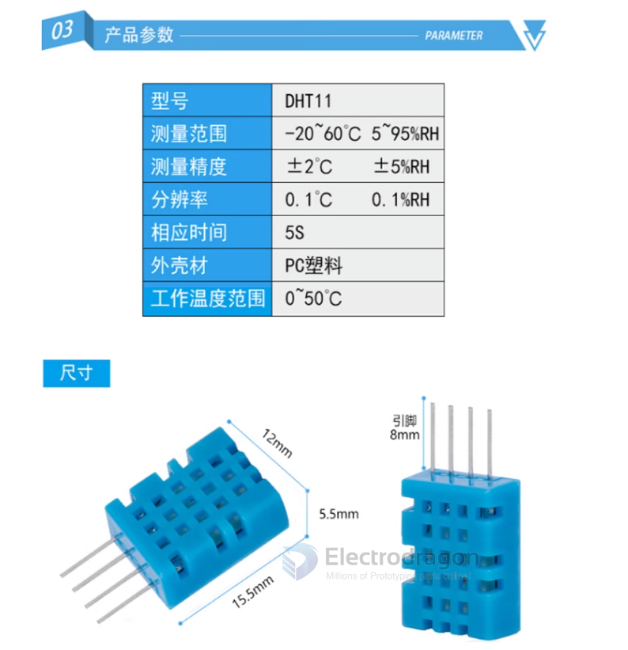
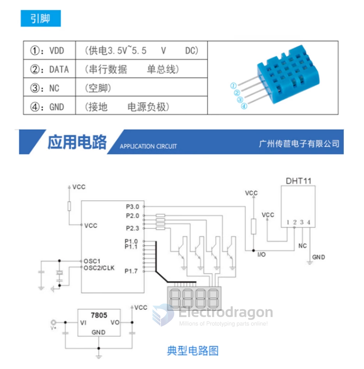

# STH1046-dat

- legacy wiki page - https://www.electrodragon.com/w/index.php?title=DHT11

## Specs 

Precision = -/+ 2 C
Resolution = 0.1 C 

## Pin and circtuis 

## library and demo code 
- http://arduino.cc/playground/Main/DHT11Lib
- http://hackaday.com/2012/01/11/dht11-humidity-and-temperature-sensor-package/

## ref 

- [[aosong-dat]]
