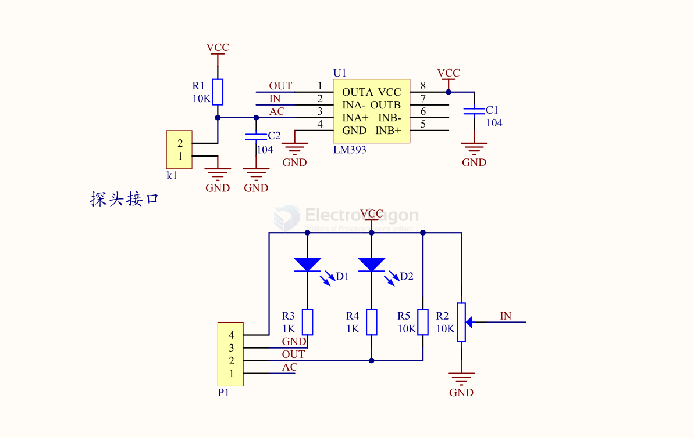

# SCU1049-dat

## Info

[Product URL - Rain Water Drop Sensor](https://www.electrodragon.com/product/water-drop-rain-sensor/)

## Product Use:

Arduino robot kits, rain drop/rain sensors. Can be used for monitoring various weather conditions and converting them into digital signals and AO output.

## Product Introduction:

1.  The sensor uses high-quality FR-04 double-sided material, with a large area of 5.0\*4.0CM, and the surface is treated with nickel plating, which has superior performance in terms of anti-oxidation, conductivity, and service life.
2.  Comparator output, the signal is clean, the waveform is good, and the driving ability is strong, exceeding 15mA.
3.  Equipped with potentiometer to adjust sensitivity.
4.  Working voltage 3.3V-5V
5.  Output form: Digital switch output (0 and 1) and analog AO voltage output.
6.  Equipped with fixed bolt holes for easy installation.
7.  Small board PCB size: 3.2cm x 1.4cm
8.  Uses wide voltage LM393 comparator

## Function Introduction:

Connect to a 5V power supply, the power indicator lights up. When there are no water droplets on the sensing board, the DO output is high level, and the switch indicator is off. Drop a drop of water, the DO output is low level, and the switch indicator lights up. Brush off the water droplets, and it returns to the high-level output state.

The AO analog output can be connected to the AD port of the microcontroller to detect the amount of rain falling on it. The DO TTL digital output can also be connected to the microcontroller to detect whether it is raining.

## Wiring Method:

1.  VCC: Connect to the positive pole of the power supply (3-5V)
2.  GND: Connect to the negative pole of the power supply
3.  DO: TTL switch signal output
4.  AO: Analog signal output

## SCH 

## demo code 

- in C == [[SCU1049-c-dat.zip]]

## usage 

Usage
- Connected to 5V power supply power lights,
    - When no water droplets, DO output is high and the switch indicator lights off,
    - dropping on a drop of water, DO output is low, the switch indicator lights on,
- Brush off the the above water droplets, has returned to output to high state.
- AO analog output can be connected to the MCU AD port to detect the size of the drops in the above rainfall.
- DO TTL digital outputs can also be connected to the MCU detects whether there is rain.
- 开关指示 = Switch Indicator
- 电源指示 = Power Indicator

## change log 

- Version V1.1 
- Change the power LDO, may have better stability, move the antenna connectors to the top to fit into case desgin.
- Version V1.2 
- Add extra logic leveled UART pins 5V and 3v3 for arduino or raspberry pi such devices. 

## ref 

* [[SCU1049]]

- schematic refer to [[LM393-dat]]