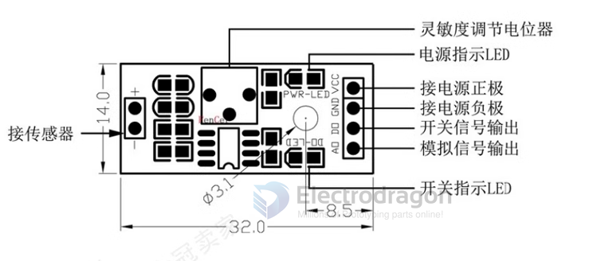
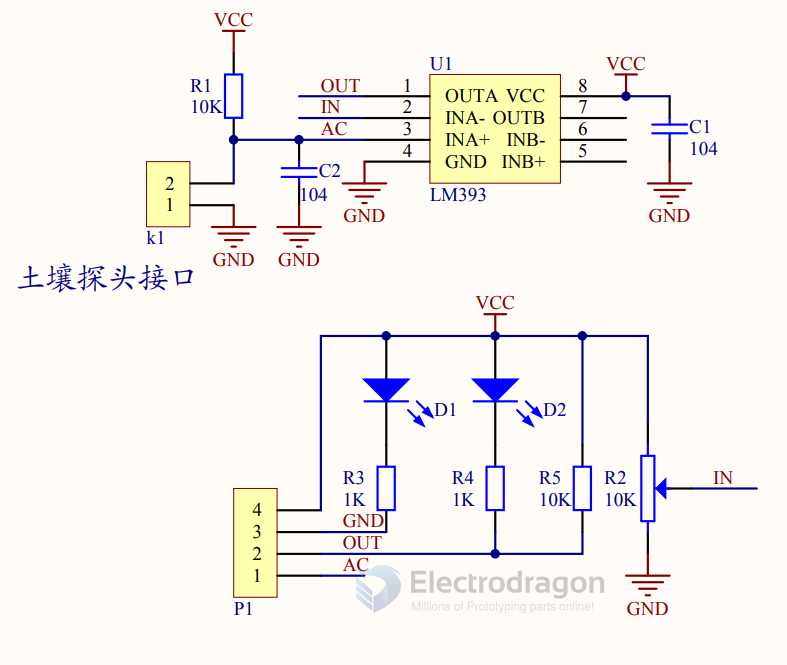

# STH1052-dat

## Info 
 
[product url](https://www.electrodragon.com/product/soildust-humiditywatermoisture-sensor/)

## Features

1. Uses our high-quality soil sensor for moisture detection. The probe surface is nickel-plated and features a widened sensing area to improve conductivity and reduce corrosion from soil contact, extending service life.
2. Wide-range soil moisture control. A potentiometer adjusts the threshold: when moisture is below the setpoint the digital output (DO) is HIGH; when above the setpoint DO is LOW.
3. Comparator: LM393 for stable operation.
4. Operating voltage: 3.3 V – 5 V.
5. Mounting holes for easy installation.
6. PCB size: 32 mm × 14 mm.

- [[LM393-dat]]

## Applications, category, tags, etc. 

- [[home-plant-dat]]

## Board map 

Sensor on the left 
Pin definitiions:
- VCC
- GND
- DO
- AO

## SCH 

## ref 

- [legacy wiki page ](https://www.electrodragon.com/w/index.php?title=Soil/Dust_Humidity/Water/Moisture_Sensor)
 
- comparator - [[LM393-dat]]
  
- [[sensor-moisture-dat]] - [[sensor-dat]]

- [[STH1052]]