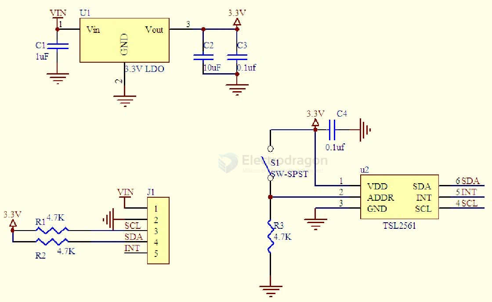

# STH1053-dat

- [[TSL2561-dat]]

- [[sensor-ambient-light-dat]]

## Info

[product url - Ambient Light Intensity Sensor TSL2561 Breakout](https://www.electrodragon.com/product/ambient-light-intensity-sensor-tsl2561-breakout/)

### Board Map, Dimension, Pins, chip info, Use Guide, Setup Jumper, etc.

SCH 

## Applications, category, tags, etc. 

## Demo Code and Video

- available at [[arduino-dat]] repo arduino, please look for STH-STH1053 

## ref 

- [[STH1053]] 

- [legacy wiki page ](https://w.electrodragon.com/w/Category:Light_Sensor)

