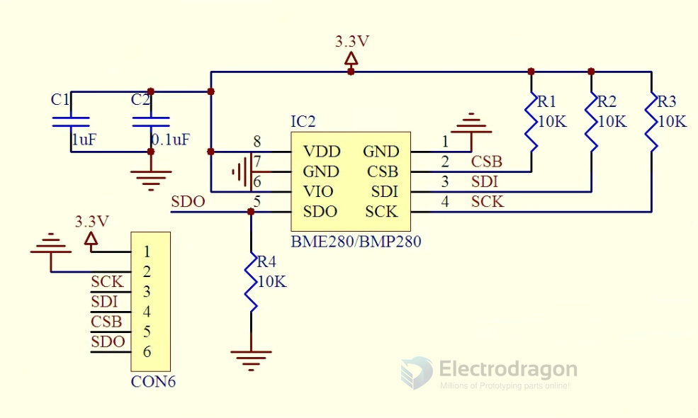

# STH1058-dat

## Description

ME-BME280 is a Breakout Board featuring a Bosch Sensortec ME280 Temperature, Humidity & Pressure Sensor. 
The board has selectable I2C address jumper (solder link GS2), I2C pull-up resistors, 7 pin header 2.54mm, and two mounting holes 3.5mm.

Default setting of the board; single power rail Vdd=Vdd_IO (solder link GS1), pull-ups resistors (R2, R3) 10k, protocol selector resistor 0ohm (R1), decoupling capacitors 0.1uF on both power supply pins Vdd & Vdd_IO.
If you connect board to both power rails VDD_IO 1.8V and VDD 3.3V be sure to remove the power rail jumper GS1!

## schematic 

## ref 

- [[BME280-dat]]

- [[STH1058]]