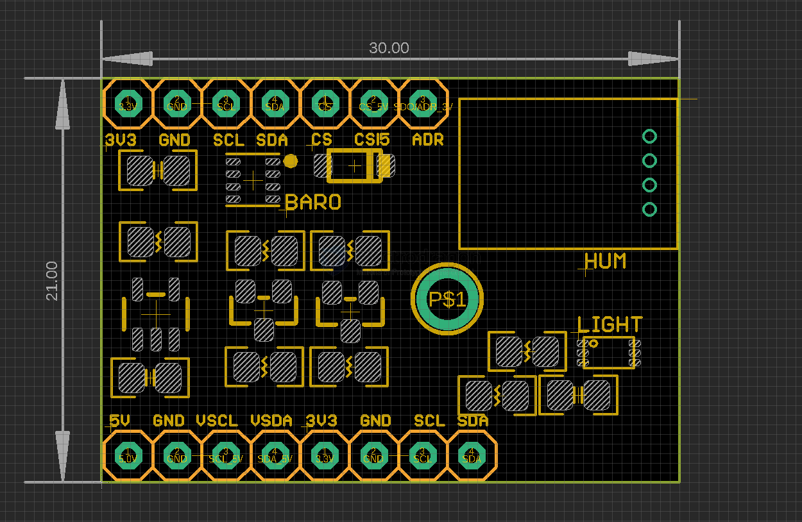

# STH1068-dat

## Info

[product url - Feeling Sensors Pack IIC Utility](https://www.electrodragon.com/product/feeling-sensors-pack-iic-interface/)

onboard available sensors 

- [[BMP280-dat]] - [[barometer-sensor-dat]] - [[pressure-sensor-dat]]

- [[BH1750FVI-dat]] - [[light-sensor-dat]]

- [[AM2322-dat]] - [[humidity-dat]]

- [[logic-level-shifter-dat]] 

### Board Map, Dimension, Pins, etc.

## Applications, category, tags, etc. 

## Demo Code and Video

https://github.com/Edragon/Arduino/tree/master/Sketchbook/04_sensor/sensor_pack

## ref 

- [[STH1068]] 

- legacy wiki page 
