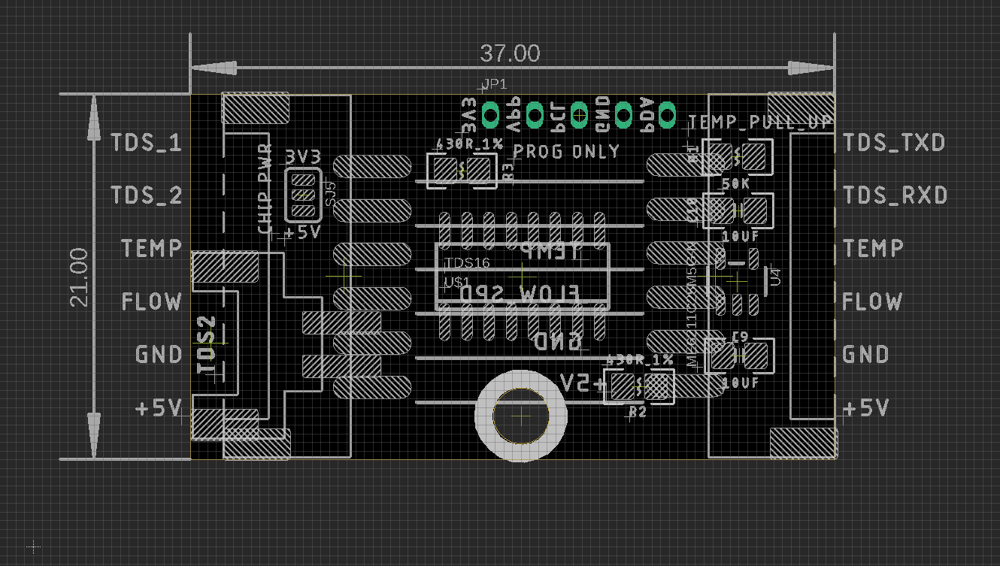

# STH1078-DAT

## Info
 
[product url - Pipe Water Sensor, Temperature Flow Speed TDS](https://www.electrodragon.com/product/pipe-water-sensor-temperature-flow-speed-tds/)

Three sensing measurement in one module:

- Flow Speed 
- TDS 
- Temperature

Specs: 
- Current selling version == DN8 
- Optional Customizable == DN10

### Board Map 

## Applications, category, tags, etc. 
 

## Demo Code and Video
 
- TDS - hex bytes output from 0x0000 to 0xffff
  - For example, FA012C0041, FA header, 012C first TDS value, 0041 second TDS value.
- Flow Speed - pulse count by interrupt, e.g. arduino D2 pin 
- Temperature - analog read 

## ref 
 
- [[STH1078]] - custom chip info read at [[TDS16-dat]]

- more sensor information read at [[EDWater3-dat]]
 
- [legacy wiki page ](https://w.electrodragon.com/w/TF-TDS_Sensor)

- relevant demo code please find at: https://github.com/Edragon/Arduino-main

- read tds hex data: https://github.com/Edragon/Arduino-main/blob/master/Sketchbook/Sensor/TF-TDS/TF-TDS-01/TF-TDS-01.ino

- [[sensor-water-dat]]
