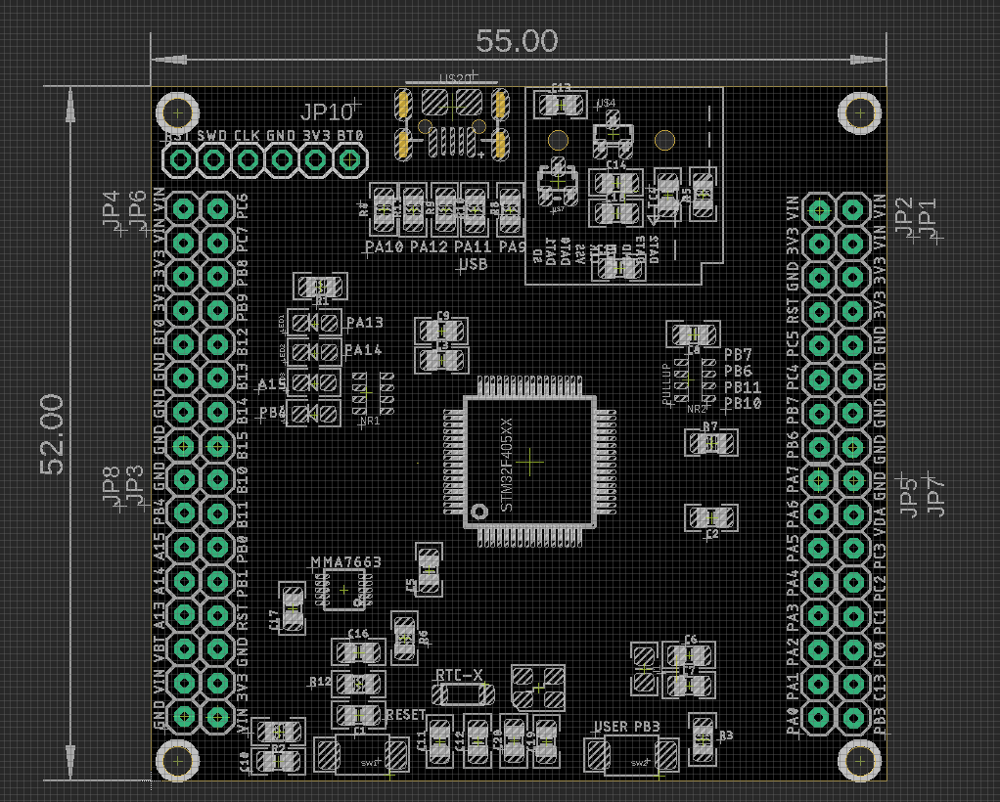
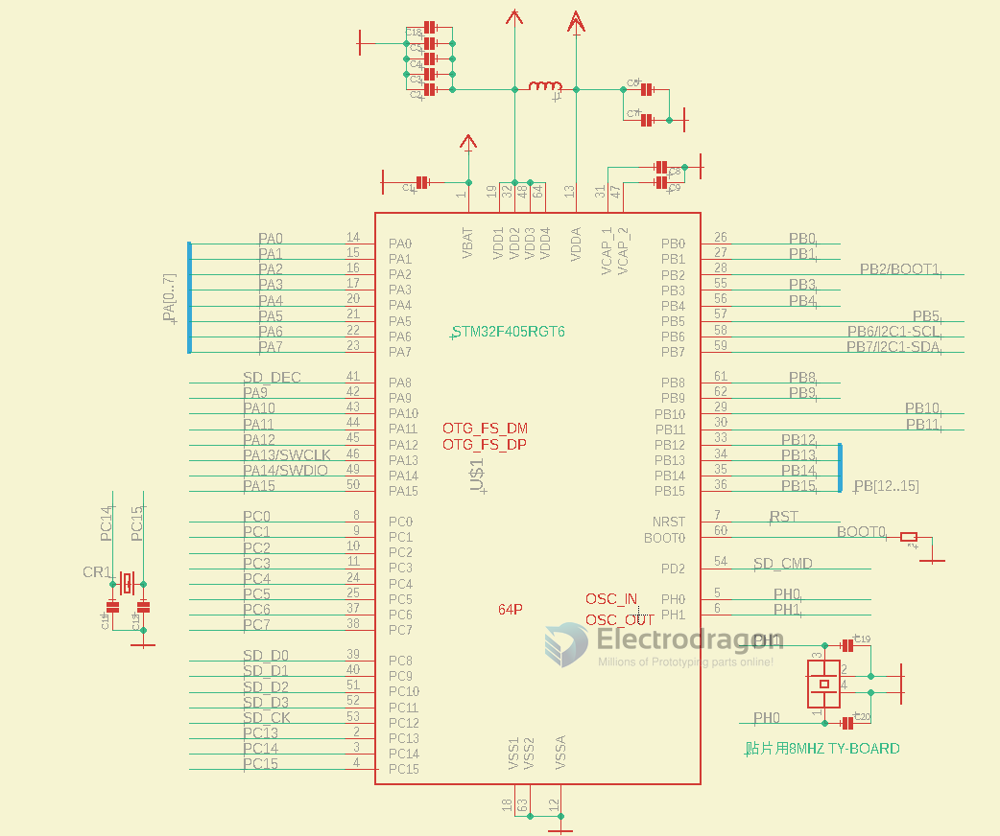

# STM1004 DAT 

## Board overview 

https://www.electrodragon.com/product/stm32f405-mini-development-board-micropython-compatible-pyboard/

STM32F405RGT6 
- LQFP-64

## Pin Map 

## Used Pin 

- LED1~4 PA13 14 15, PB4
- button PB3, reset 
- pull-up PB6 PB7 PB10 PB11

## demo testing code

    import pyb

    while True:
        pyb.LED(1).on()
        pyb.LED(2).on()
        pyb.LED(3).on()
        pyb.LED(4).on()
        pyb.delay(500)

        pyb.LED(1).off()
        pyb.LED(2).off()
        pyb.LED(3).off()
        pyb.LED(4).off()
        pyb.delay(500)

## demo 

- https://t.me/electrodragon3/214

- 

## ref 

- [[MMA7660-dat]] - [[SD-card-dat]] - [[circuits-dat]]

- [[micropython-dat]] firmware please find in out [[repository]]

- [[STM1004]] - [[micropython]]