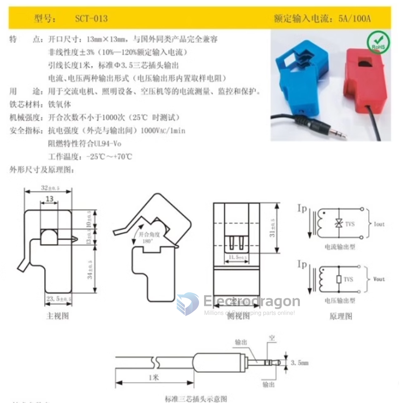

# SVC1010-dat

- [[YHDC-dat]]

## Specs 

- Model: SCT013
- Frequency: 50HZ-1KHZ
- Rated input current: 0-100A
- Rated output current: 0-50mA
- Rated output voltage: 0-1V
- Features:
- Size of the opening:
- 13mm×13mm, fully compatible with similar foreign products; accuracy: less than or equal to 1%; lead length 1.5 meters, standard Φ3.5 three-core plug output; two output forms: current and voltage (voltage output type has built-in sampling resistor).
- Purpose:
- Used for current measurement, monitoring and protection of AC motors, lighting equipment, air compressors, etc. Core material: ferrite Mechanical strength: opening and closing times not less than 1,000 times (tested at 20°C)
- Safety indicators: Electrical strength (between shell and output) 6000V AC/1min Flame retardant properties comply with UL94-V0
- Working temperature: -25℃～+70℃

## Datasheet 

## available versions 

- 5A/1%
- 10A/1V/1%
- 15A/1V/1%
- 20A/1V/1%
- 30A/1V/1%
- 50A/1V/1%
- 60A/1V
- 100A/1V/1%
- 100A/50MA

## monitor board 

- https://www.electrodragon.com/product/arduino-energy-monitoring-shield-v2/

- [[DAS1010-dat]]

## ref 

- [CT Senors – Introduction](http://openenergymonitor.org/emon/buildingblocks/ct-sensors-introduction)
- [CT Sensors – Interfacing with an Arduino](http://openenergymonitor.org/emon/buildingblocks/ct-sensors-interface)
- [CT Sensors – How to build an arduino energy monitor](http://openenergymonitor.org/emon/buildingblocks/how-to-build-an-arduino-energy-monitor-measuring-current-only)

- [[sensor-dat]] - [[SVC1010]]