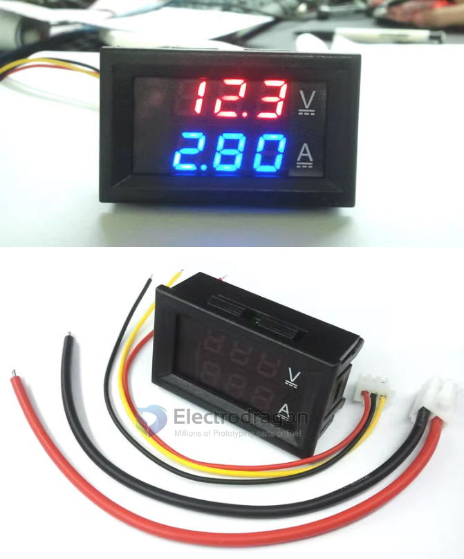
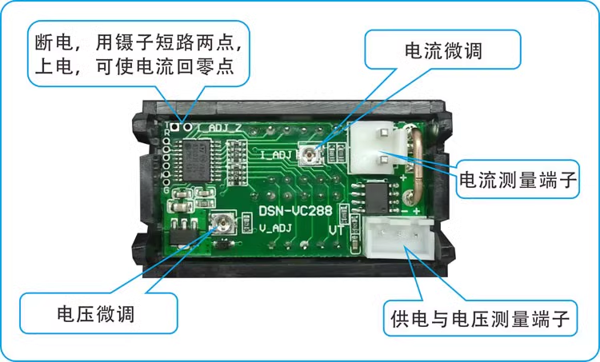
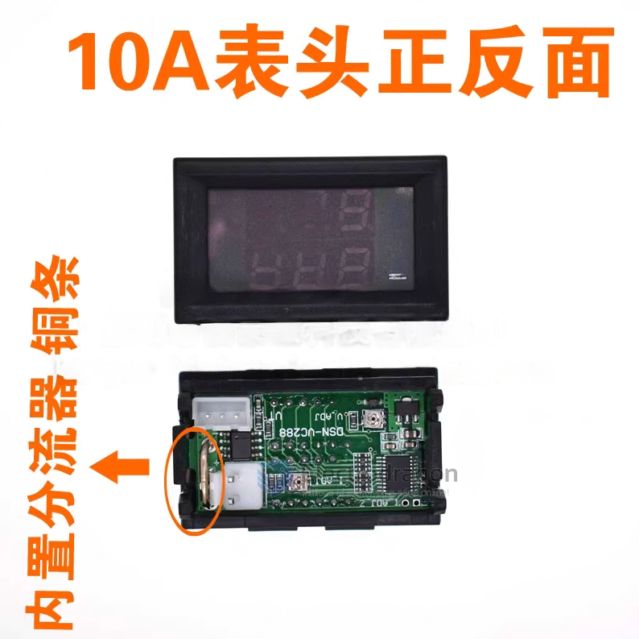
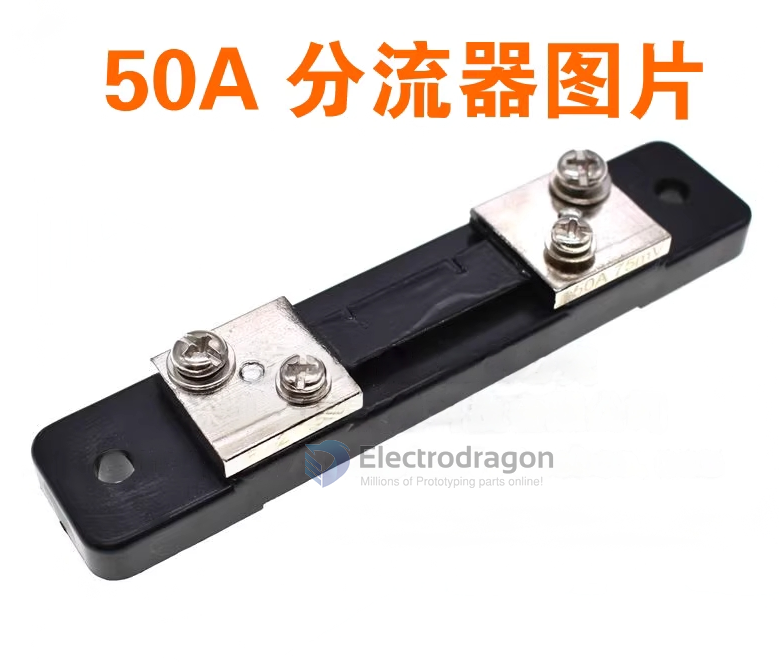

# SVC1015-DAT

- [[meter-dat]] - [[meter-voltage-current-dat]] - [[SVC1015-dat]]

## Info

- [legacy wiki page](https://w.electrodragon.com/w/Voltmeter_Ammeter)

- Voltage measurement range 0.0V-100V
- Current test range 0-10A
- Power supply range DC4-30.0V (if the voltage exceeds 30V, an external independent power supply is required)

## Wiring 
- top left, hold and power up to set to zero
- bottom left, fine tune voltage 
- middle top - fine tune current 
- top right - measure current 
- bottom right - measure voltage and power supply 

## Version 

10A with internal shunt 

50/100A external shunt 

## Specs

| Specs                         | data                                         |
| ----------------------------- | -------------------------------------------- |
| Voltage measurement range     | 0.0V-100V                                    |
| Current test range            | 0-10A, 0-50A, 0-100A (3 ranges available)    |
| Power supply range            | Note: DC4-30.0V (note1)                      |
| voltage error                 | ±0.1%                                        |
| Current error                 | ±1%                                          |
| External shunt specifications | 75 milliohms                                 |
| Working current               | < 20mA                                       |
| Refresh speed                 | About 300mS once                             |
| Display method                | Double three digit 0.28" LED digital tube    |
| Display color                 | Red + red, red + blue. Optional              |
| Lead length                   | 15cm                                         |
| Dimensions                    | 48 x 29 x 22 mm, length x width x thickness; |
| Mounting holes                | 46x27mm                                      |
| net weight                    | g                                            |
| gross weight                  | g                                            |
| Operating temperature         | -10℃~65℃                                     |

- note1 = if the voltage exceeds 30V, an external independent power supply is required

## ref

- [[svc1015-dat]] - [[svc1017-dat]] - [[svc1019-dat]]
