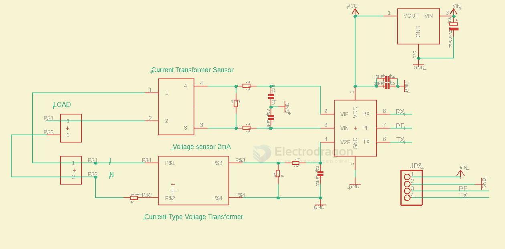

# SVC1035-dat 

- [[HLW8032-ISO-Version-dat]]

## SCH 

Pins Definitions 

- VIN
- GND
- PF
- TX 

## working principle 

- current sensing by current Transformer
- votlage sensing by wire cross through the voltage transformer 

## Sensors 

- [[ZMCT103-dat]] - [[ZMPT107-dat]] - [[zeming-dat]]

## ref 

- [[HLW8032-dat]] - [[HLW-dat]]

- [[svc1035]]