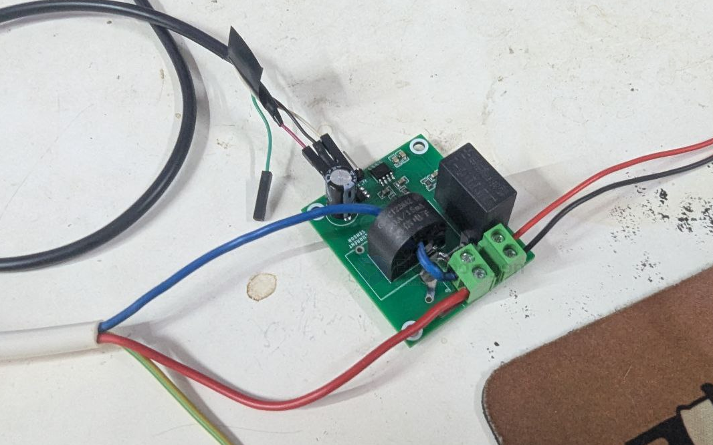
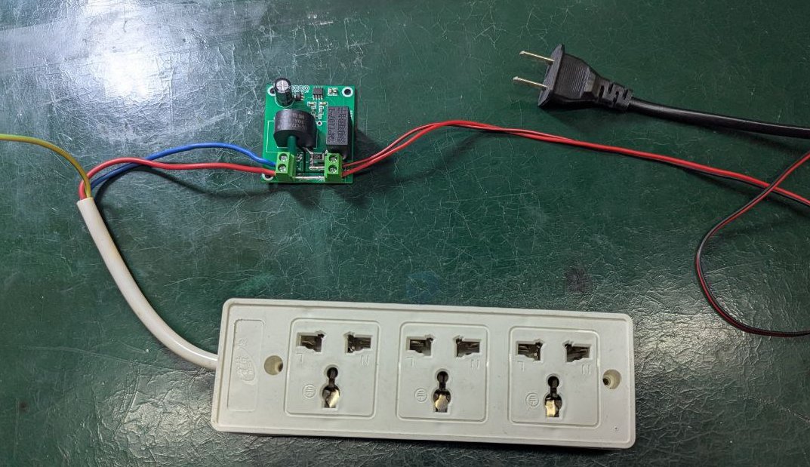
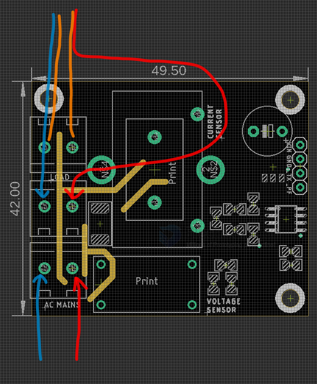

# SVC1038-dat

This is an upgradion board from the old board [[SVC1035-dat]] 

## Info

[product url - VAC Energy Meter Power Sensor Board, HLW8032 Isolated V2 [Amp]](https://www.electrodragon.com/product/vac-energy-meter-power-sensor-board-hlw8032-isolated-version/)

### Board Map, Dimension, Pins, chip info, Use Guide, Setup Jumper, etc.

Board map 

- note the [[current-transformer-dat]] (section BX-CT) sensor has two types footprint, bigger and smaller, to compatible with more types of sensors

New Wiring (default)

- connnect [[AC-mains-dat]] input from the bottom blue and red wire 
- connect the load to the top blue and red wire

Old Wiring

- The orange wires are the old wiring method, only use when the [[current-transformer-dat]] has wire inside

## Applications, category, tags, etc. 

## Demo Code and Video

- [[HLW8032-dat]]

## ref 

- [[SVC1038]] 

- legacy wiki page 
