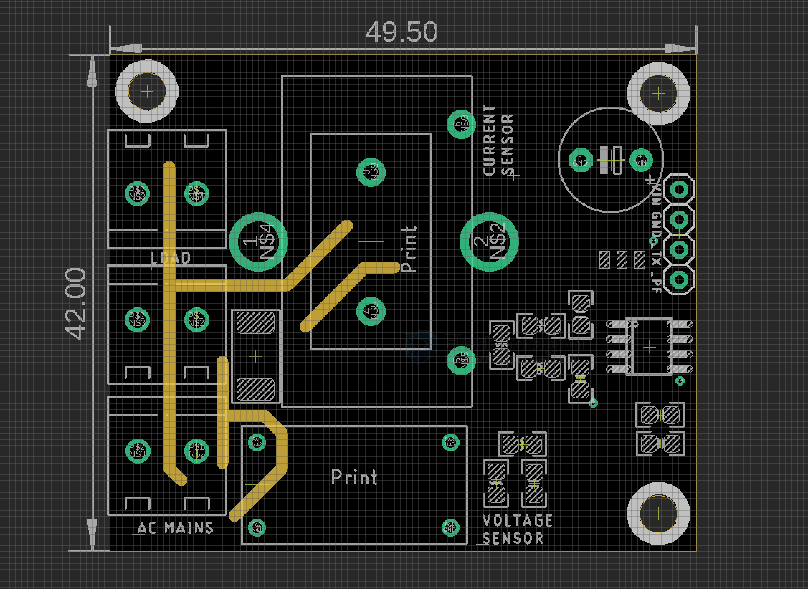

# SVC1038-dat

## Info

product url - 

### Board Map, Dimension, Pins, chip info, Use Guide, Setup Jumper, etc.

Board map 

- note the [[current-transformer-dat]] sensor has two types footprint, bigger and smaller, to compatible with more types of sensors 

## Applications, category, tags, etc. 

## Demo Code and Video

## ref 

- [[SVC1038]] 

- legacy wiki page 
