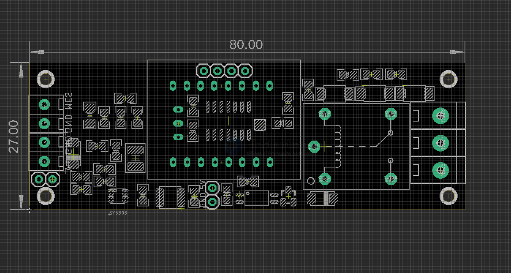

# svc1039 dat

- env setup [[megaTinyCore-dat]]

- https://www.electrodragon.com/product/vac-current-sensing-module-0-5a-ct-sensor/

## pin definitions 

chip all pin lead out, free to hack 

- core chip - [[attiny1604-dat]] - [[tinyAVR-dat]]

| design | extra | arduino | index | left | right | index | arduino | extra    | design               |
| ------ | ----- | ------- | ----- | ---- | ----- | ----- | ------- | -------- | -------------------- |
|        |       |         | 1     | VCC  | GND   | 14    |         |          |                      |
| relay  |       | 0       | 2     | PA4  | PA3   | 13    | 10      |          | Input voltage sensor |
| LED    |       | 1       | 3     | PA5  | PA2   | 12    | 9       |          | Current sensor       |
|        |       | 2       | 4     | PA6  | PA1   | 11    | 8       |          | BTN                  |
|        |       | 3       | 5     | PA7  | PA0   | 10    | 11      | RST/UPDI | UPDI                 |
| RXD    |       | 4       | 6     | PB3  | PB0   | 9     | 7       |          | I2C-SCL              |
| TXD    |       | 5       | 7     | PB2  | PB1   | 8     | 6       |          | I2C-SDA              |

- on board power regulator - [[DCDC-down-dat]] == 40V / 3A - [[silergy-dat]]

main function 
- Current sensor = 9 == [[dc-current-sensor-dat]]
- Input voltage sensor = 10 == [[dc-voltage-sensor-dat]]
- relay = PA4 D0 - [[relay-dat]] - [[mcu-relay-dat]]

genernal usage - [[peripherals-dat]] - [[led-dat]] - [[button-dat]]
- Buttons = 8
- led = PA5 D1 1
- UPDI = PA0 

PA1 = 8 = BTN
PA2 = 9 = CS
PA3 = 10 = VS

OLED - [[OLED-dat]] - [[I2C-dat]]
- PB0 - SCL
- PB1 - SDA

UART - [[serial-dat]]
- PB3 = RXD
- PB2 = TXD

## define in arduino 

    #define relay 1
    #define led 0 

## demo code / video 

demo code please find at [[tinyAvR-dat]]

- [[arduino-OLED]]

## ref 

- [[sensor-current-dat]] - [[sensor-voltage-dat]]

- [[attiny1604-dat]] - [[ATtiny-dat]]