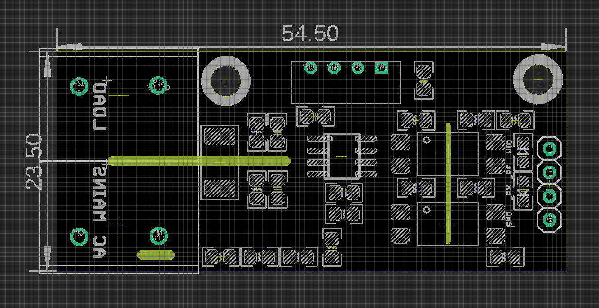

# SVC1041-dat

## Info

[product url - Energy Meter HLW8032 Breakout Board V3 [Ver]](https://www.electrodragon.com/product/energy-meter-hlw8032-breakout-board/)

### Board Map, Dimension, Pins, chip info, Use Guide, Setup Jumper, etc.

assembled using board 

board map 

Connect the AC loads on the top and AC mains input from the bottom.

## Applications, category, tags, etc. 

## Demo Code and Video

- [[HLW8032-dat]]

## ref 

- [[SVC1041]] 

- legacy wiki page 

