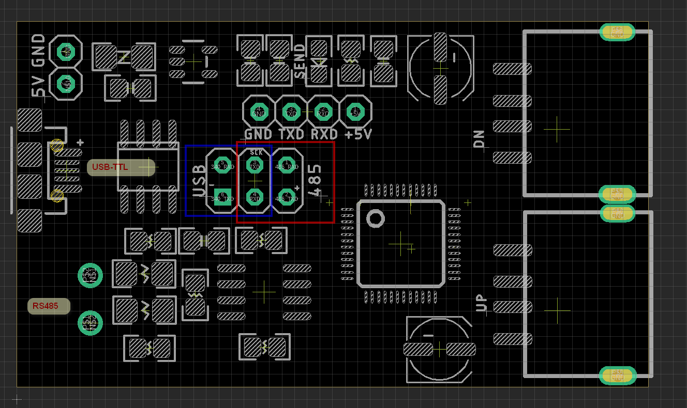
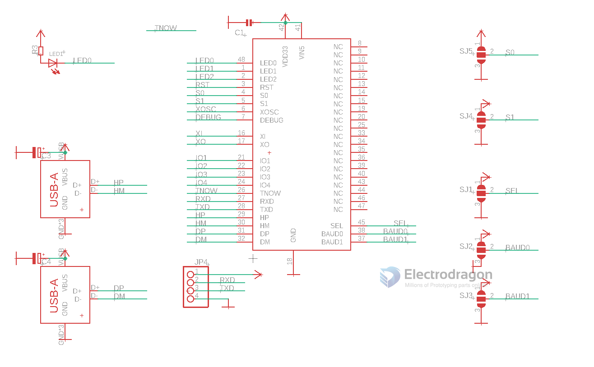

# USB1003 DAT

- 5V/GND external power supply
- blue box: chip output to USB
- red  box: chip output to RS485

## check points

- RS485 no output? 
  - please check if the jumper is set to red box
  - USB and RS485 output can not be selected in the same time.

## SCH 

- SCH1 of chip 

- SCH2 peripheral 

## Configuration 

Default baud rate is 115200

S1 / S0
* 11 = mode 1/0 default
* 10 = mode 2
* 01 = mode 3
* 00 = mode 4

baud1 / baud 0 
* 11 = 115200 baudrate default 
* 01 = 57600
* 10 = 38400
* 00 = 300 000

SEL
* 1 = master mode
* 0 = slave mode

## ref 

- https://www.electrodragon.com/product/usb-hid-to-uart-rs-485-extension-board/
- v1 documentation: https://www.electrodragon.com/w/CH9350

