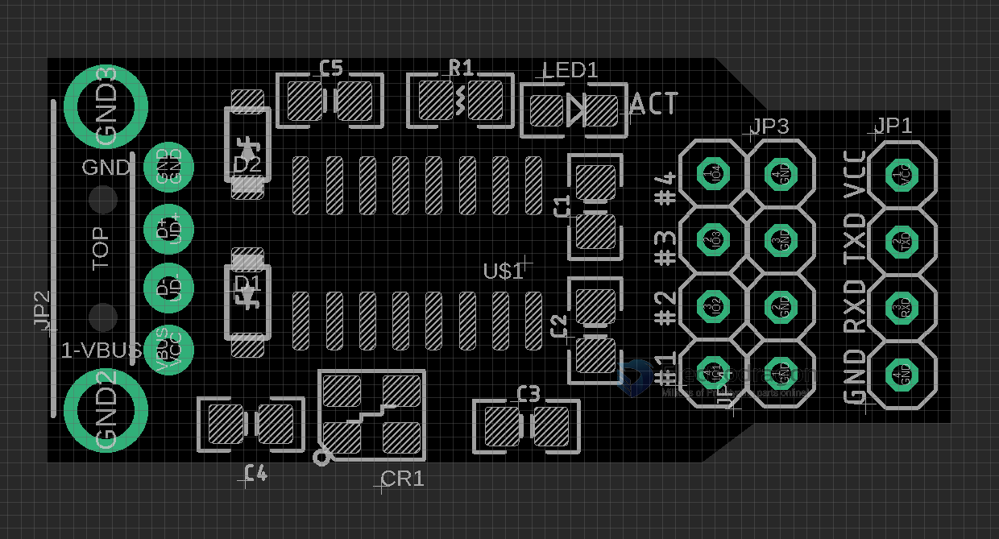

# USB1006 

- output interface serial. default baudrate 9600 - [[USB-TTL-dat]]

## USB-HID Device 

* The Board is driver free in WIN 10, and recgnized as "USB input device", see attached image.

## Mode Setup

* All Jumper off: Mode 0
* #1 Jumper on:   Mode 1
* #2 Jumper on:   Mode 2
* #3 Jumper on:   Mode 3
* #4 Jumper on:   High speed mode

### Mode 0 
* This mode only supports the conversion of characters corresponding to visible ASCII codes (such as a-z, 0-9, @, #, $, etc.) into standard USB key values.
* Special function: If the received serial data packet encounters 0x1B, the data after 0x1B in the current packet will be discarded, and 0x1B will be converted into the enter key.
### Mode 1 
* This mode only supports the conversion of characters corresponding to visible ASCII codes (such as a-z, 0-9, @, #, $, etc.) into standard USB key values.
### Mode 2 
* This mode only supports the conversion of characters corresponding to visible ASCII codes (such as a-z, 0-9, @, #, $, etc.) into standard USB key values.
* Special function: If the received serial data packet encounters 0x28, it will convert 0x28 into the enter key.
###Mode 3 
* This mode is a transparent transmission mode, which is not only used to transmit visible ASCII characters. Standard USB full keyboard function can be realized in this mode.
* Every 8 bytes of serial data form a packet, and after every 8 bytes received by the chip, it is directly packaged and uploaded through the USB port. That is, the chip is in the transparent transmission mode, and the serial port data is not analyzed and converted, and directly uploaded in a packet of 8 bytes. Therefore, the serial port data must be sent according to the standard USB keyboard data packet.
* For example, if "A" is pressed, the serial port will send data packets: 0x00, 0x00, 0x04, 0x00, 0x00, 0x00, 0x00, 0x00;
* For example, if the analog "A" is released, the serial port sends data packets as: 0x00, 0x00, 0x00, 0x00, 0x00, 0x00, 0x00, 0x00;
* For example, if you press "A+SHIFT" simultaneously, the serial port will send data packets: 0x02, 0x00, 0x04, 0x00, 0x00, 0x00, 0x00, 0x00;

Please refer to datasheet of modes

## Wiring 

The wiring please try: 

- your device TXD -> “Serial to HID Keyboard Emulator” RXD
- your device RXD -> “Serial to HID Keyboard Emulator” TXD
- GND - GND

## Example demonstration 

- First can you double check the output signal is RS232 or TTL? The correct  input signal should be TTL, which differs from RS232. 
- You have to find a USB-TTL testing bridge cable or PCB Board to test, for example, CH340, FT232, CP210x. 

For example, 

- if you want to send the string "Hello" to the computer through the serial port, select 0 for the module mode
- Enter the hexadecimal number in the serial port: 0x48 0x65 0x6c 0x6c 0x6f. 
- Open a txt text file at random on the computer, and when the serial port is sent, "Hello" will be displayed on the text.
- And last, you need to send by hexadecimal from your device, and receive a text string on the USB HID side.

    0x48 0x65 0x6c 0x6c 0x6f -> Hello (open a text editor to see)

## Config 

- [download at here. ](https://www.wch.cn/uploads/file/20181221/1545373585137913.zip)
- support to config VID, PID, GPIOs' directions, serial baudrate, etc

## demo 

- https://t.me/electrodragon3/205

- https://x.com/electro_phoenix/status/1654749466929553411

## ref 

- [[USB-HID-dat]] - [[USB-dat]]

- [[USB1006]]