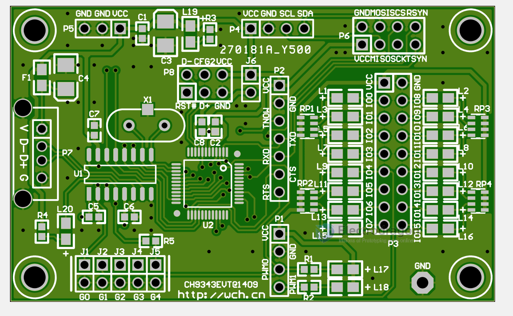
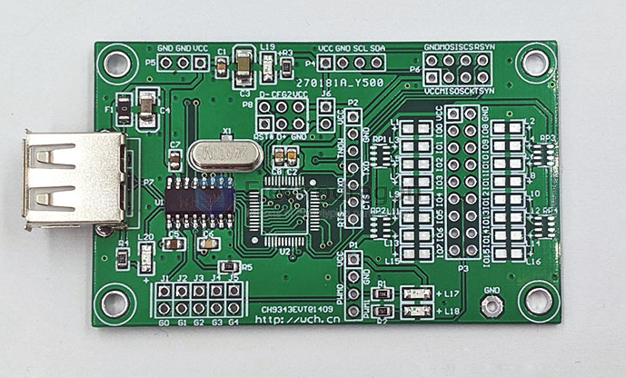
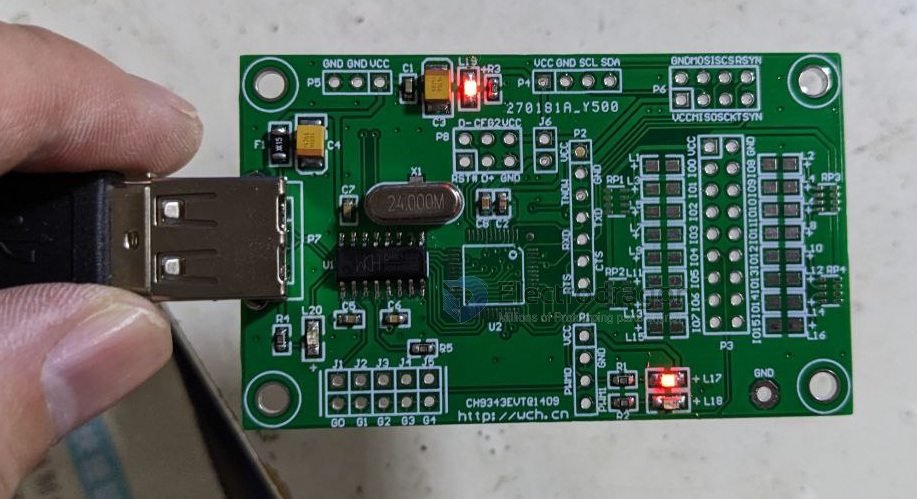

# USB1014

https://www.electrodragon.com/product/android-host-interface-board-ch9343g/

Android Host Interface Board CH9343G

- chip - [[ch9343-dat]]

- [[USB1014]]

## board map 

P1 = PWMO
p2 = Serial 
P3 = GPIO 
P4 = I2C
P5 = Power Supply VCC/GND
P6 = SPI 
P7 = USD
P8 = USB2
J1 ~ J5 = ? 
J6 = ? 

## ref 

- repository - https://github.com/Edragon/WCH-CH9343
  - inside original PCB file and SCH

- chip page link - http://www.wch.cn/product/ch9343.html

