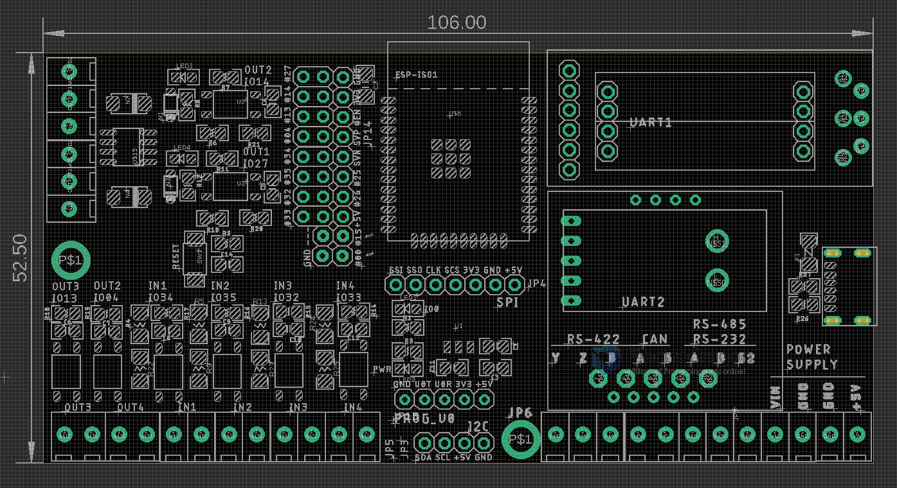
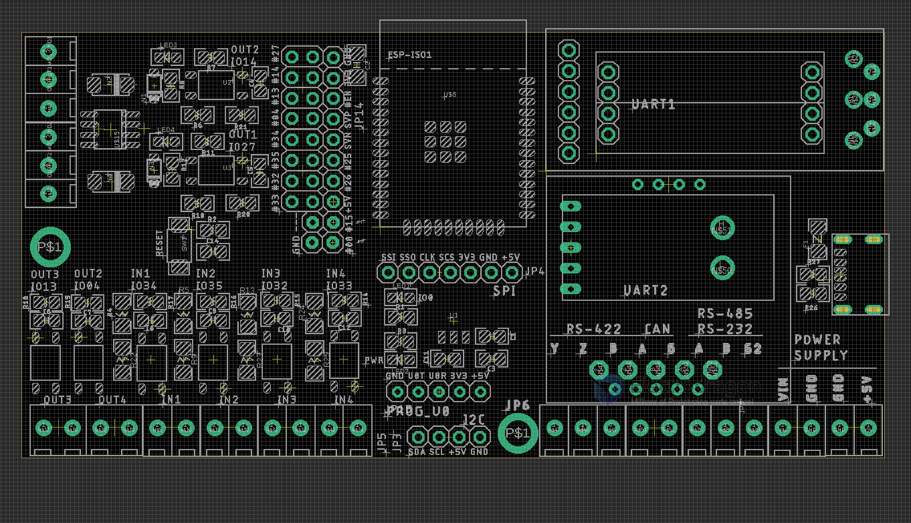
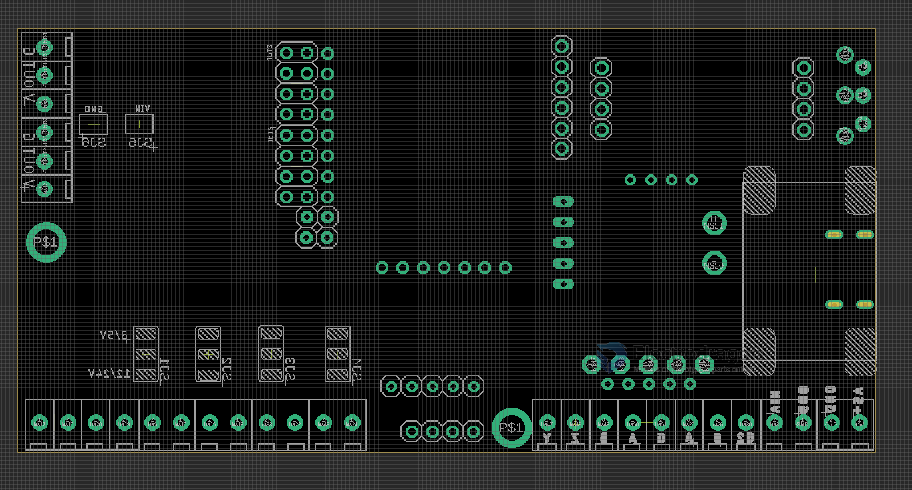
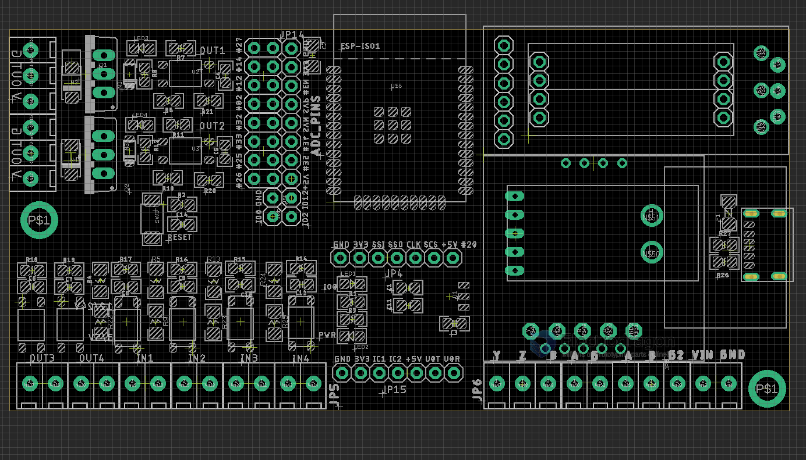
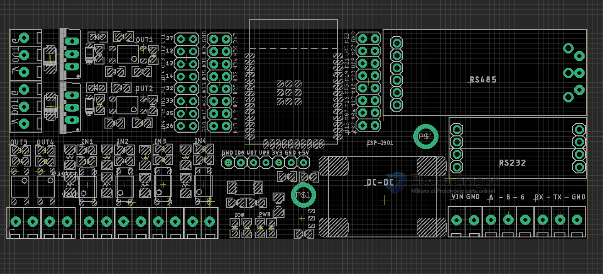

## ESP32 ISO board

## Board Pin Definitions

### Version V4 

### Version V3 

### Version V2

### Version V1

## Pin Definitions Template

| Pin | Prerequisite | V2       |            | Used for V1 | Note V1    |
| --- | ------------ | -------- | ---------- | ----------- | ---------- |
| 36  | input_only   | >>       |            | >>          |            |
| 39  | input_only   | >>       |            | >>          |            |
| 34  | input_only   | IN1      | via jumper | >>          |            |
| 35  | input_only   | IN2      | via jumper | >>          |            |
| 32  |              | IN3      | via jumper | IN1         | via jumper |
| 33  |              | IN4      | via jumper | IN2         | via jumper |
| 25  | DAC          | >>       |            | IN3         | via jumper |
| 26  | DAC          | >>       |            | IN4         | via jumper |
| 27  |              | OUT1     | via jumper | OUT1        | via jumper |
| 14  |              | OUT2     | via jumper | OUT2        | via jumper |
| 12  | strapping    | SDA      |            | >>          |            |
| 13  |              | OUT3     | via jumper | I2C         |            |
| 15  | strapping    | >>       |            | I2C         |            |
| 2   | strapping    | SCL      |            | >>          |            |
| 0   | strapping    | >>       |            | >>          |            |
| 4   |              | OUT4     | via jumper | OUT4        | via jumper |
| 16  |              | U2_T     |            | U2          |            |
| 19  |              | VSPI_SO  |            | VSPI        |            |
| 17  |              | U2_R     |            | U2          |            |
| 5   | strapping    | VSPI_CS  |            | VSPI        |            |
| 18  |              | VSPI_CLK |            | VSPI        |            |
| 20  | x NC         |          |            | OUT3        | via jumper |
| 21  |              | U1_R     |            | U1          |            |
| 3   | U0R          | U0R      |            | U0          |            |
| 1   | U0T          | U0T      |            | U0          |            |
| 22  |              | U1_T     |            | U1          |            |
| 23  |              | VSPI_SI  |            | VSPI        |            |

## breakout daughter board

- RS232 [[DPR1084-dat]] - RS485 [[MSP1076-dat]] - DCDC [[OPM1153-dat]]

## Use Guide

- connect IO0 to GND to enter into programming mode

## ref

- [[inductive-load-dat]] - [[interface-dat]]

- [[ESP32-dat]]

- [[esp32-iso]]

- [[power-meter-dat/power-sensor-dat]] - [[I2C-dat]]

## Demo video

- RS485 / RS422 / RS232 / CAN brekaout board with ESP32 ISO Board test - [youtube here](https://www.youtube.com/watch?v=ea_zn8Yjx-0&t=3s&ab_channel=Electrodragon).
