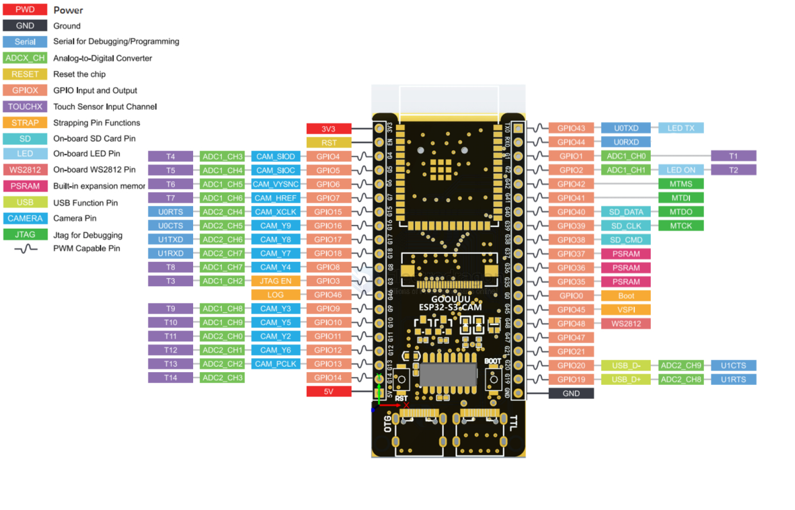
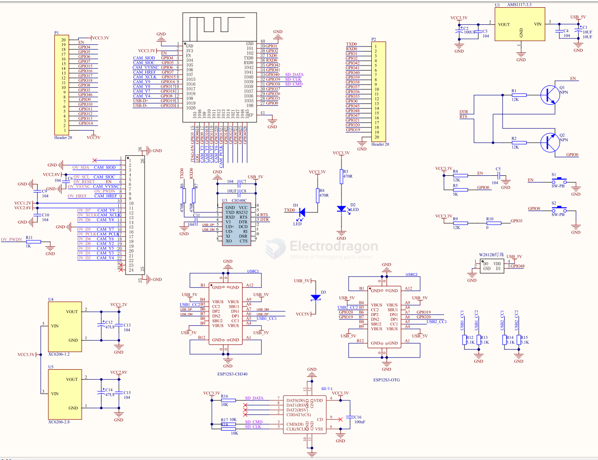
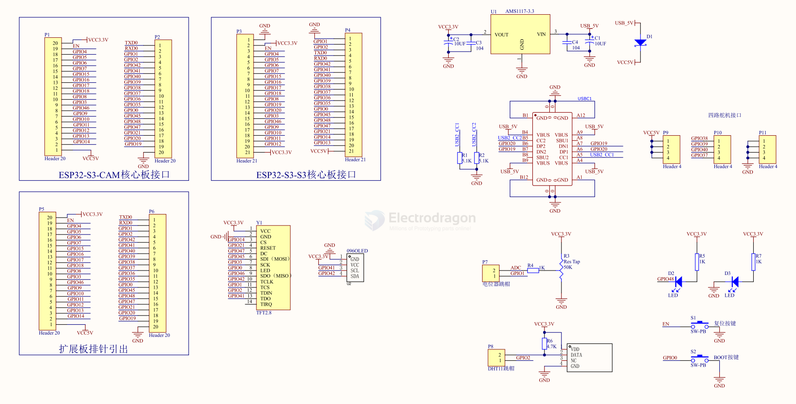

# ESP32-S3-cam-dat

## pin map 

## SCH 

- GPIO 3 == pull-up 
- GPIO 35 == LED 
- EN == button, pull-up, filter-cap 
- IO0 == button, pull-up

## Extension board SCH 

## init debug boot log 

    mode:DIO, clock div:1
    load:0x3fcd0108,len:0x15c8
    load:0x403b6000,len:0x8c8
    load:0x403ba000,len:0x2c04
    entry 0x403b61c4
    I (24) boot: ESP-IDF v4.4-dev-2594-ga20df743f1-dirty 2nd stage bootloader
    I (25) boot: compile time 16:57:21
    I (25) boot: chip revision: 0
    I (28) boot.esp32s3: SPI Speed      : 80MHz
    I (33) boot.esp32s3: SPI Mode       : DIO
    I (38) boot.esp32s3: SPI Flash Size : 2MB
    I (43) boot: Enabling RNG early entropy source...
    W (48) bootloader_random: RNG for ESP32-S3 not currently supported
    I (55) boot: Partition Table:
    I (59) boot: ## Label            Usage          Type ST Offset   Length
    I (66) boot:  0 nvs              WiFi data        01 02 00009000 00006000
    I (73) boot:  1 phy_init         RF data          01 01 0000f000 00001000
    I (81) boot:  2 factory          factory app      00 00 00010000 00100000
    I (88) boot: End of partition table
    I (92) esp_image: segment 0: paddr=00010020 vaddr=3c020020 size=090e0h ( 37088) map
    I (108) esp_image: segment 1: paddr=00019108 vaddr=3fc90dd0 size=0253ch (  9532) load
    I (111) esp_image: segment 2: paddr=0001b64c vaddr=40374000 size=049cch ( 18892) load
    I (122) esp_image: segment 3: paddr=00020020 vaddr=42000020 size=1b660h (112224) map
    I (147) esp_image: segment 4: paddr=0003b688 vaddr=403789cc size=08404h ( 33796) load
    I (154) esp_image: segment 5: paddr=00043a94 vaddr=50000000 size=00010h (    16) load
    I (160) boot: Loaded app from partition at offset 0x10000
    I (160) boot: Disabling RNG early entropy source...
    W (164) bootloader_random: RNG for ESP32-S3 not currently supported
    I (182) cpu_start: Pro cpu up.
    I (182) cpu_start: Starting app cpu, entry point is 0x40375104
    I (0) cpu_start: App cpu up.
    I (196) cpu_start: Pro cpu start user code
    I (196) cpu_start: cpu freq: 160000000
    I (196) cpu_start: Application information:
    I (199) cpu_start: Project name:     led_strip
    I (204) cpu_start: App version:      1
    I (209) cpu_start: Compile time:     Aug 17 2021 17:09:47
    I (215) cpu_start: ELF file SHA256:  bda59acbde3f7a0e...
    I (221) cpu_start: ESP-IDF:          v4.4-dev-2594-ga20df743f1-dirty
    I (228) heap_init: Initializing. RAM available for dynamic allocation:
    I (235) heap_init: At 3FC94220 len 0004BDE0 (303 KiB): D/IRAM
    I (241) heap_init: At 3FCE0000 len 0000EE34 (59 KiB): STACK/DRAM
    I (248) heap_init: At 3FCF0000 len 00008000 (32 KiB): DRAM
    I (255) spi_flash: detected chip: generic
    I (259) spi_flash: flash io: dio
    W (263) spi_flash: Detected size(16384k) larger than the size in the binary image header(2048k). Using the size in the binary image header.
    I (277) cpu_start: Starting scheduler on PRO CPU.
    I (0) cpu_start: Starting scheduler on APP CPU.
    I (308) example: LED Rainbow Chase Start
    I (308) example: USB initialization
    I (308) tusb_desc: 

    ...

    I (478) TinyUSB: TinyUSB Driver installed
    I (488) example: USB initialization DONE
    I (1388) example: log -> UART
    example: print -> stdout
    example: print -> stderr
    I (2888) example: log -> UART
    example: print -> stdout
    example: print -> stderr
    I (4388) example: log -> UART
    example: print -> stdout
    example: print -> stderr

## sdk 

- [[circuitpython-esp32-s3-dat]] - [[camera-sdk-dat]]

## ref 

- [[ESP32-S3-dat]]