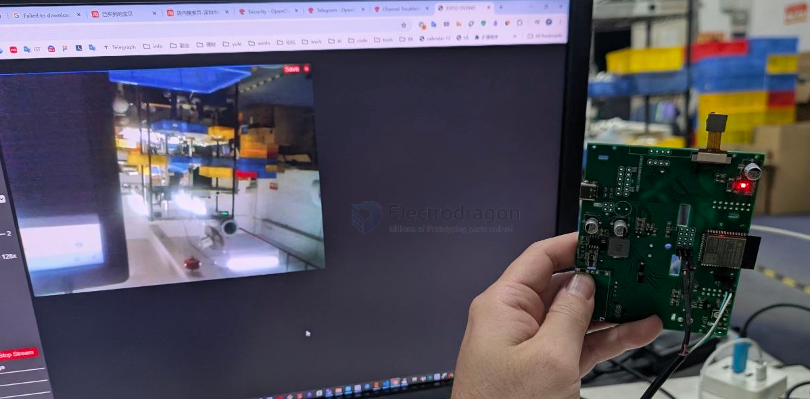

# robotpet-dat

- [[sensor-camera-dat]] - [[NWI1249-dat]]

- [[apds-9960-dat]] - [[OLED-dat]] - [[I2C-dat]]

    Scanning...
    I2C device found at address 0x39  !
    I2C device found at address 0x3C  !
    done

## camera 

board_config.h 

    #define CAMERA_MODEL_ESP32S3_EYE // Has PSRAM

camera_pins.h

    #elif defined(CAMERA_MODEL_ESP32S3_EYE)

    #define PWDN_GPIO_NUM  -1
    #define RESET_GPIO_NUM -1

    #define XCLK_GPIO_NUM  15
    #define SIOD_GPIO_NUM  4
    #define SIOC_GPIO_NUM  5

    #define Y9_GPIO_NUM    16
    #define Y8_GPIO_NUM    17
    #define Y7_GPIO_NUM    18
    #define Y6_GPIO_NUM    12
    #define Y5_GPIO_NUM    10
    #define Y4_GPIO_NUM    8
    #define Y3_GPIO_NUM    9
    #define Y2_GPIO_NUM    11

    #define VSYNC_GPIO_NUM 6
    #define HREF_GPIO_NUM  7
    #define PCLK_GPIO_NUM  13

## code 

- speaker - [[MAX98357-dat]] - [[speaker-I2S-dat]]

    // MAX98357
    #define MAX_DIN 36   
    #define MAX_LRC 47   
    #define MAX_BCLK 35  

## demo 

- speaker - [[MAX98357-dat]] - [[speaker-I2S-dat]] == https://t.me/electrodragon3/444

## ref 

- [[MAX98357]]