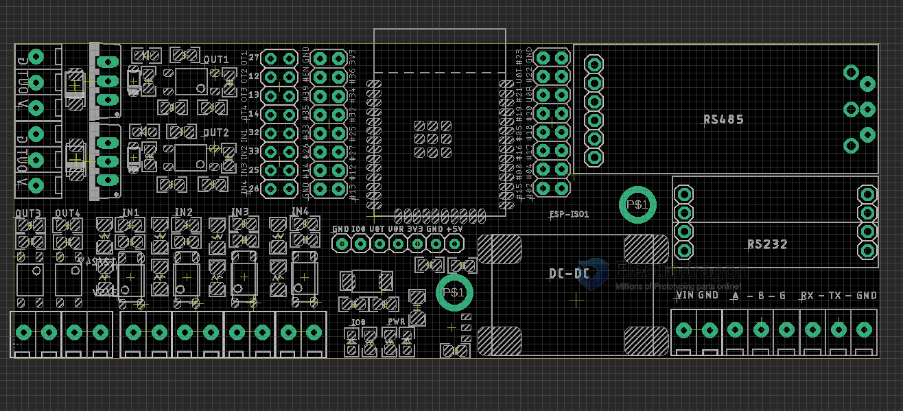

## ESP32 ISO board 

## Board Pin Definitions 

## Occupied Pins 

    #define IN1 32
    #define IN2 33
    #define IN3 25
    #define IN4 26

    #define OUT1 27
    #define OUT2 14
    #define OUT3 13
    #define OUT4 15

    #define debugLED 0

    #define RS232_RX 23
    #define RS232_TX 22
    #define RS485_RX 18
    #define RS485_TX 19

    SoftwareSerial RS232;
    SoftwareSerial RS485;

## breakout daughter board 

- [[DPR1084-dat]] - [[rs485-autoboard-1]] - [[OPM1153-dat]]

## Use Guide 
- connect IO0 to GND to enter into programming mode 

## ref 

- [[inductive-load-dat]] 

- [[ESP32-dat]]

- [[ESP32-ISO]]