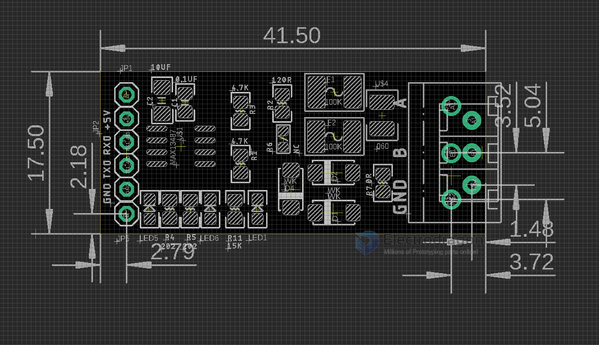
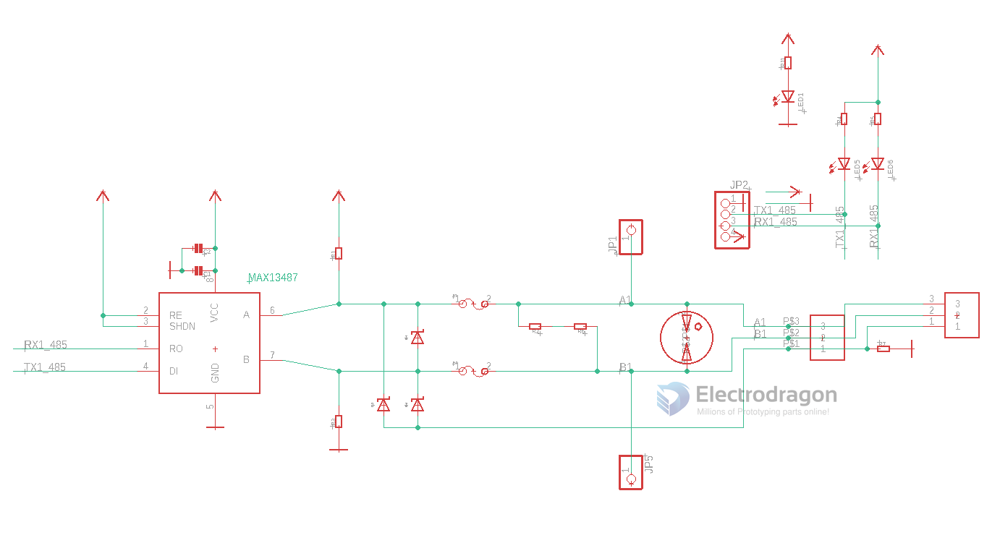

# RS485 auto board 1 

Left Side Pins 
- A
- 5V
- RXD
- TXD
- GND
- B

Right Side Pins 
- A
- B
- GND

## On board Protections 

- TVS 
- Fuse 
- Lightning protection

## Features 

- [[MAX13487-dat]]

## schematic 

