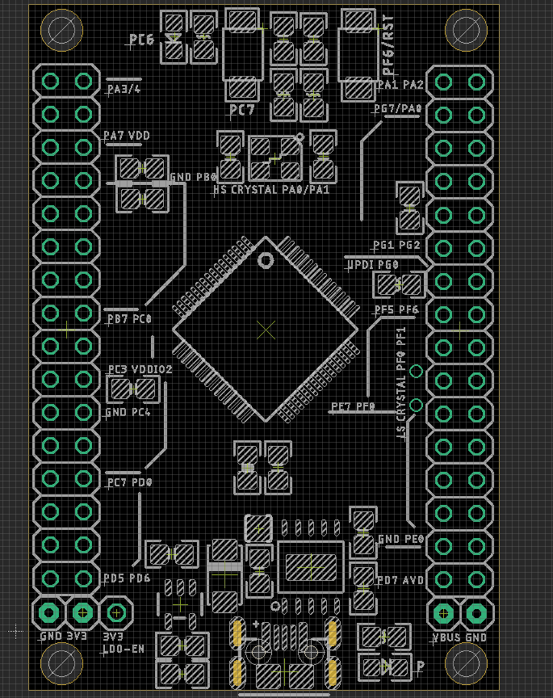

# DAR1064 

## hardware 

Power Supply 
- normally 5V

Power Supply VDDIO2 
- to VDD

UART Selector 
- PB0 PB1
- PE0 PE1

## Usage 

- Install Driver for [[CH340-DAT]], check CH340K
- Power LED indicator should be light up

## ref 

https://w.electrodragon.com/w/Category:AVR128#AVR128_Board

- [[DAR1064]]

