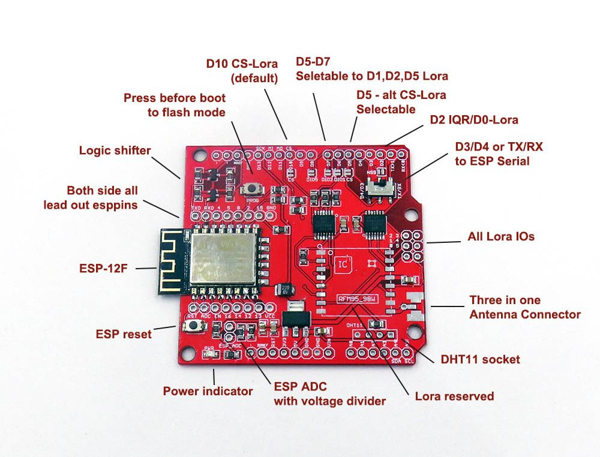
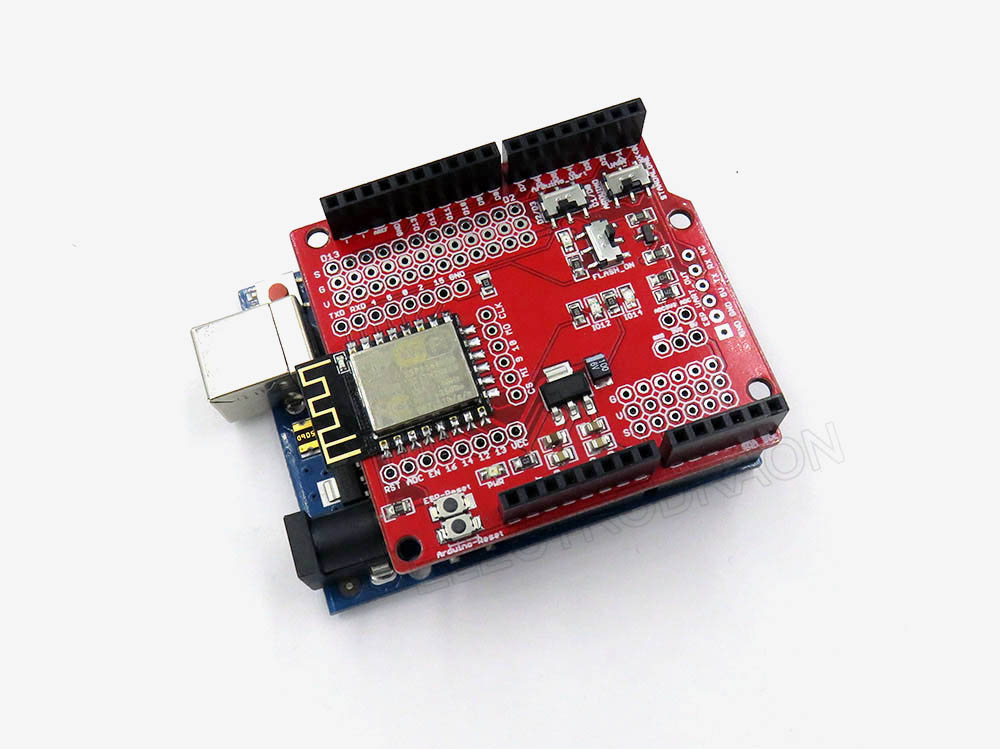

# DAS1069-dat 

## Version 2 

## Version 1 

### Configuration
* Flash -> ON | OFF -> Set flash mode, flash LED will turn on
* Arduino Serial  ->  D1/D0 | D3/D2 - Arduino serial switch between softserial or hardware serial
* Serial Switch  -> Arduino or standalone output