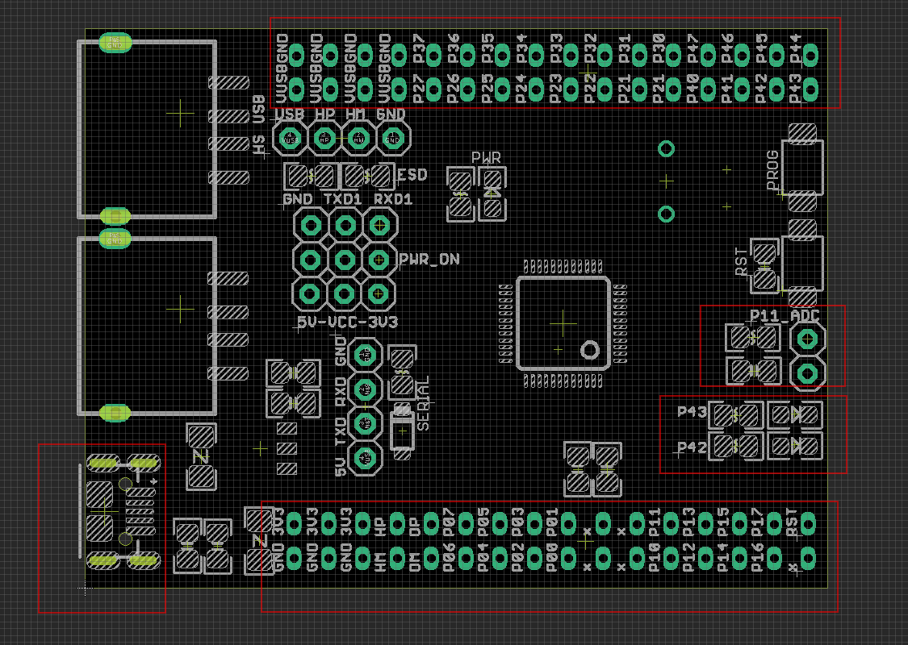
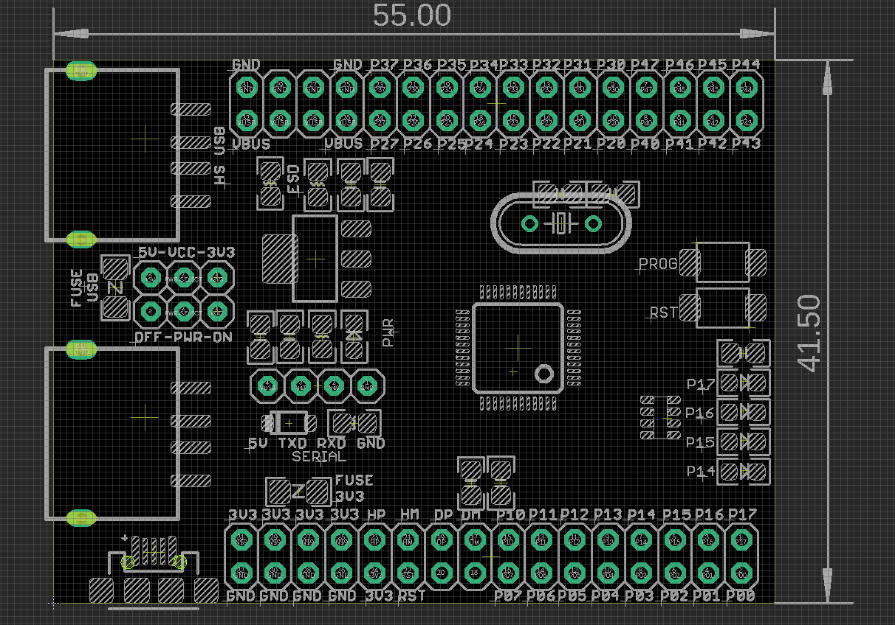
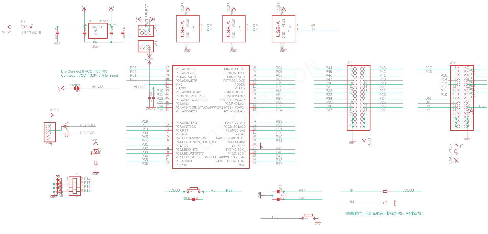

# DOD1071 DAT

## versions 

V2 updates:
- added ADC port with voltage ladder P11
- changed LED pins to P43 P42
- changed lead out pins 
- new type micro-USB part

V1

- microUSB = USBA_Female (bottom) = DM/DP
- HS_USB (top) = HS_DM/HS_DP

- LED = P14 P15 P16 P17

default firmware, demo code at our git
WCH_CH55X-APP\CH559\CH559-GPIO-LOOP-BLINK\CH559.HEX

## board sch 

## ref 

- [[CH55x-DAT]] - [[CH559-dat]]

- [[DOD1071]] 