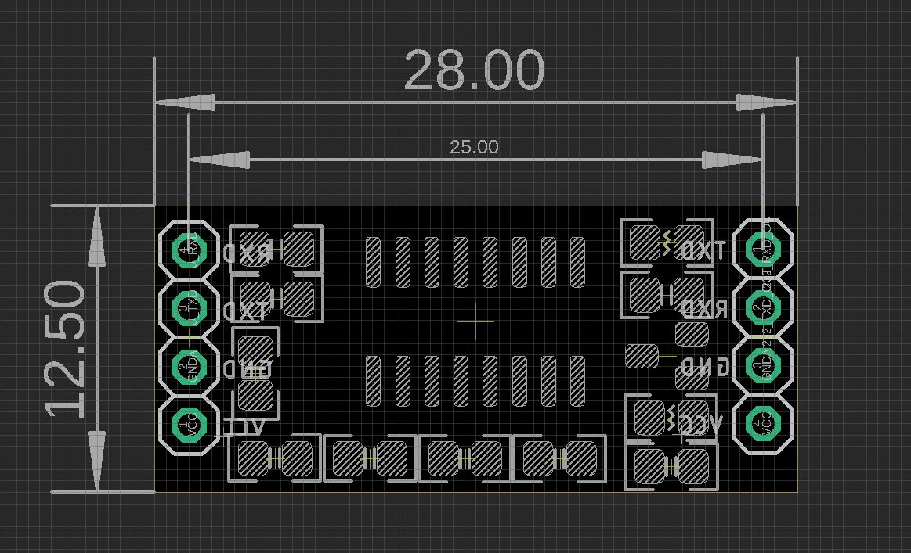

# DPR1084 DAT

## Hardware V2

- Solder method can refer to this one - [[NGS1111-DAT]]

## Usage:

- Power one side only is enough
- RS232 connect to the RS232 mark side, and TTL connect to TTL mark side
- Two signal cover channels separated, front and back side both can be used.

## Feature of V1 version 

The V1 version board (blue board) use bad chip, which cause high heat on it.

https://s5.electrodragon.com/wp-content/uploads/2016/03/Mini-USB-RS232-Convert-Board-02.jpg

- NOT genius MAX232 IC
- Input voltage 3V~5V
- Max baudrate should be not over 120kbps
- Dimension: 9.4mm*15.9mm
- Arrow indicate the data flow
- Each purchase is for 5 pcs.