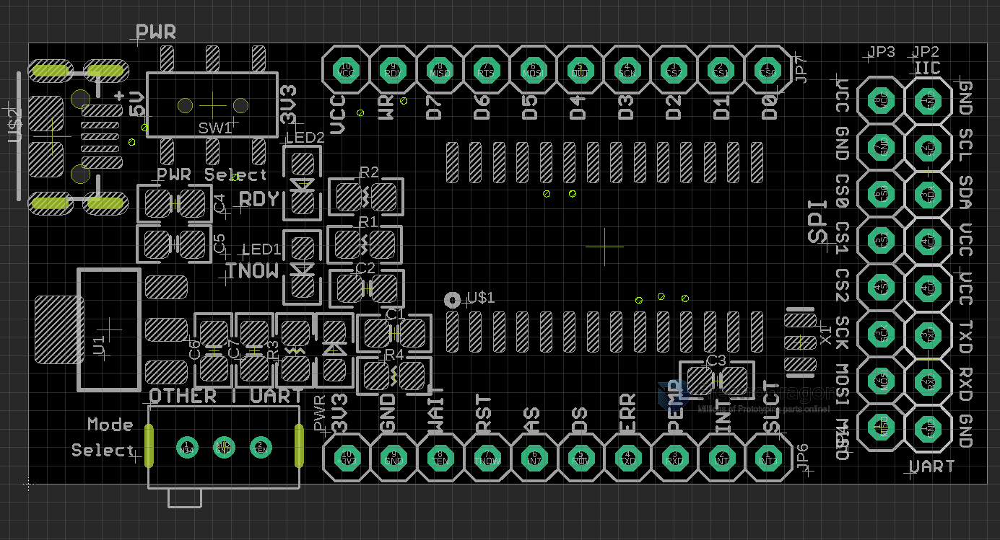

# DPR1093 dat 

SW1: switch power supply 5V or 3.3V
Mode Select: UART mode or all other modes (IIC/SPI EPP/MEM ENBALE)

RDY LED: ready 
TNOW LED: TNOW

Supported Interface: SPI I2C UART, parallel 

- [[CH341-DAT]]