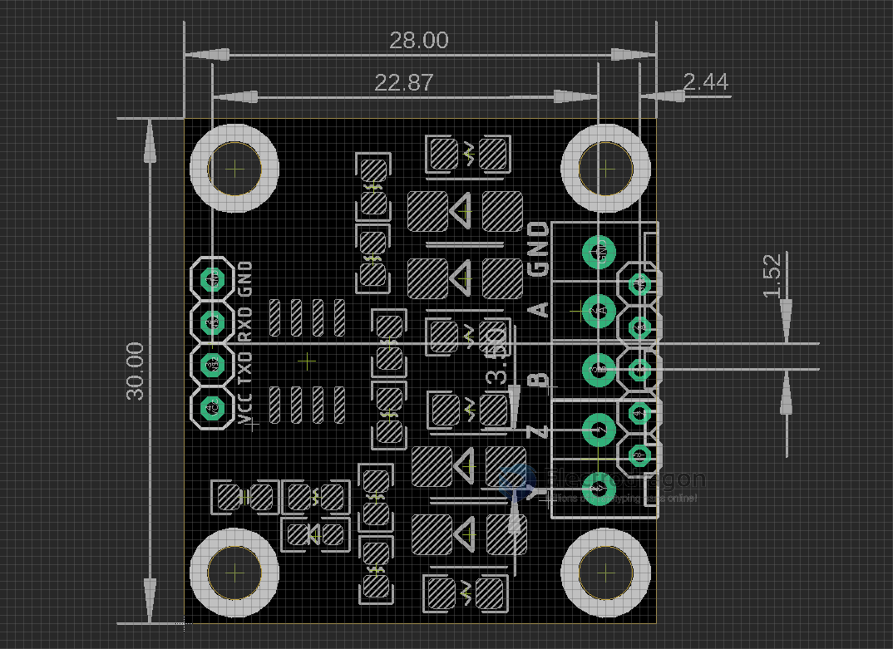

# DPR1097 RS-422

## Pin definition
- GND 
- A = R +
- B = R -
- Z = T-
- Y = T +

## Working Principle 
To run a loop test, connect A->Y, B->Z. Connect USB-TTL bridge for example PL2303TA, TXD to RXD, RXD to TXD, 5V-5V, GND-GND.

## Ref 

- https://www.electrodragon.com/product/rs422-ttl-module-full-duplex-rs-422/

Legacy Wiki 
- https://w.electrodragon.com/w/Category:Interface
- https://w.electrodragon.com/w/RS-422

- [[RS422-dat]] - [[DPR1097]]

